# Class 5:Data Vis with ggplot2
Ryan Ellis (PID:A17673864)

- [Background](#background)
- [Add some custom features](#add-some-custom-features)
- [Gene Expression](#gene-expression)
- [Going further](#going-further)

## Background

There are many graphics systems in R for making plots and figures. These
include so-called *“base R” graphics* like the `plot()` function and add
on packages like **ggplot2**.

Let’s compare how we make a simple figure with these two systems:

We can use the in-built `cars` dataset:

``` r
head (cars)
```

      speed dist
    1     4    2
    2     4   10
    3     7    4
    4     7   22
    5     8   16
    6     9   10

``` r
plot(cars)
```

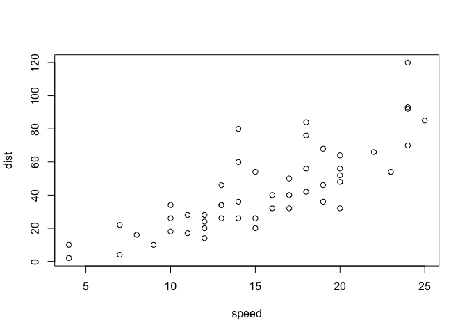

Before I can use ggplot 2 I need to install it on mu computer. To do
this we can use the function `install.package("ggplot2")`

> **N.R** We never run `install.package()` in our quarto doc (we run it
> once only in the R console (R brain)), if we ran it in the doc it
> would reinstall the package everytime we render.

once installed we need to load the package into our R brain:

``` r
library(ggplot2)
```

The main function in **ggplot 2** package is called `ggplot()`

``` r
ggplot(cars)
```


Every ggplot has at least 3 layers:

- the **data** (a data.frame of the stuff we want to plot)
- the **aes**thetics (how the data maps to the plot)
- the **geom** layer (how you want the map to be drawn, ie. points,
  lines, etc.)

``` r
ggplot(cars)+
  aes(x=speed , y=dist )+
  geom_point()
```

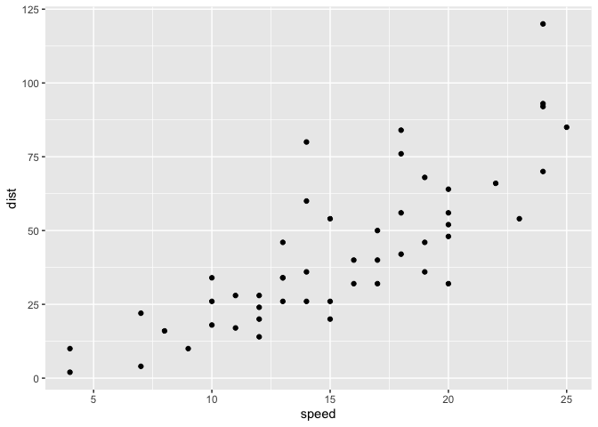

## Add some custom features

Let’s add a trend line that shows a relationship between speed and
distance

``` r
ggplot(cars)+
  aes(x=speed , y=dist )+
  geom_point()+
  geom_line()
```

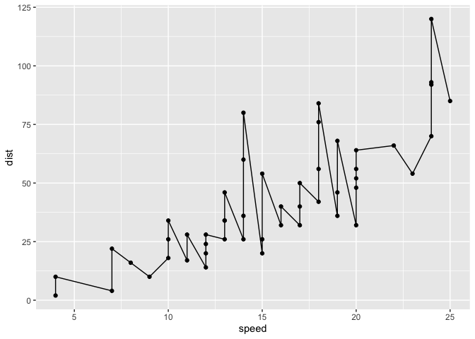

``` r
ggplot(cars)+
  aes(x=speed , y=dist )+
  geom_point()+
  geom_smooth()+
  theme_bw()+
  labs(title= "Stopping Dist of old cars", 
       x="Speed(MPH)", 
       y="Dist(ft)")
```

    `geom_smooth()` using method = 'loess' and formula = 'y ~ x'

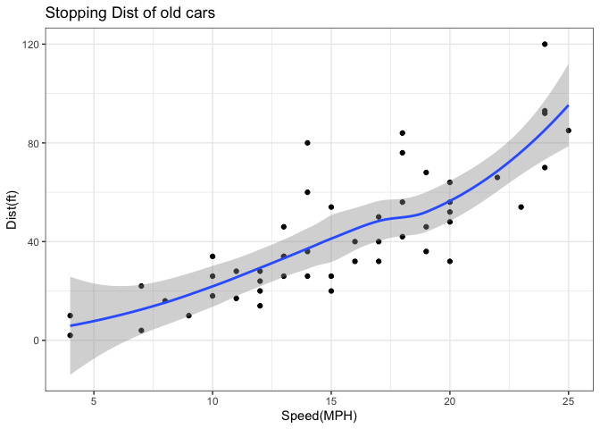

Q. Can you make `geom_smooth()` produce a linear straight line of best
fit for the data and turn off the “grey” error region.

------------------------------------------------------------------------

## Gene Expression

``` r
url <- "https://bioboot.github.io/bimm143_S20/class-material/up_down_expression.txt"
genes <- read.delim(url)
head(genes)
```

            Gene Condition1 Condition2      State
    1      A4GNT -3.6808610 -3.4401355 unchanging
    2       AAAS  4.5479580  4.3864126 unchanging
    3      AASDH  3.7190695  3.4787276 unchanging
    4       AATF  5.0784720  5.0151916 unchanging
    5       AATK  0.4711421  0.5598642 unchanging
    6 AB015752.4 -3.6808610 -3.5921390 unchanging

A useful new function in this context is the `table()` function

``` r
table(genes$state)
```

    < table of extent 0 >

My first Plot attempt

``` r
ggplot(genes)+
  aes(Condition1, Condition2, col=State)+
  geom_point()+
  scale_color_manual (values=c("purple", "gray", "orange"))+
  theme_bw()+
  labs(x= "No Drug", y= "Drug", title= "Expression chnages upon GLP-1 inhibitor treatment")
```

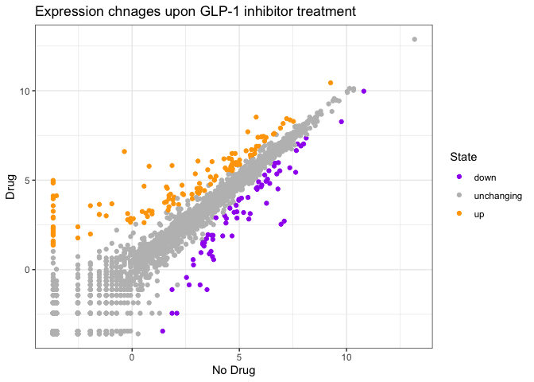

## Going further

Here we read the famous gapmider data set:

``` r
# File location online
url <- "https://raw.githubusercontent.com/jennybc/gapminder/master/inst/extdata/gapminder.tsv"

gapminder <- read.delim(url)
head(gapminder)
```

          country continent year lifeExp      pop gdpPercap
    1 Afghanistan      Asia 1952  28.801  8425333  779.4453
    2 Afghanistan      Asia 1957  30.332  9240934  820.8530
    3 Afghanistan      Asia 1962  31.997 10267083  853.1007
    4 Afghanistan      Asia 1967  34.020 11537966  836.1971
    5 Afghanistan      Asia 1972  36.088 13079460  739.9811
    6 Afghanistan      Asia 1977  38.438 14880372  786.1134

> Q. How many entries (ie. rows) are there in the data set?

``` r
length(table(gapminder$country))
```

    [1] 142

``` r
length(unique(gapminder$country))
```

    [1] 142

Lets make our first plot of the entire dataset:

Plot of “gdpPercap” vs “lifeExp” colored by “continent”

``` r
p <- ggplot(gapminder)+
  aes(gdpPercap,lifeExp, color=continent)+
  geom_point(alpha=0.3)
```

``` r
p
```

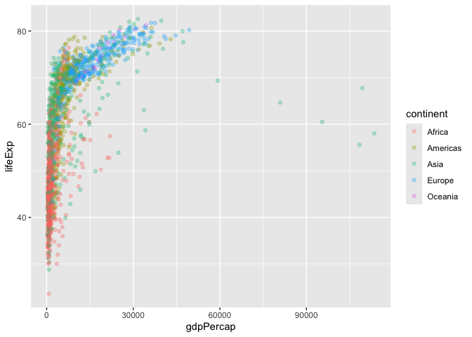

``` r
p+
  facet_wrap(~continent)
```

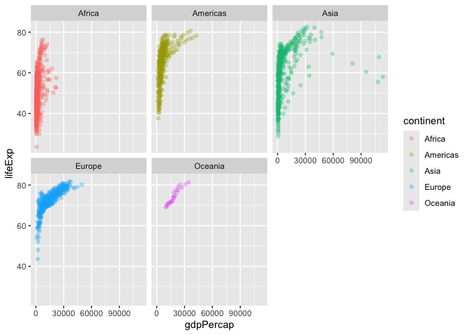

Make a plot for 1977 and 2007 only (not all years in the data set)

> Q. First use the **dplyr** package and the `filter()` function from
> that package to extract the rows from the year 2007

``` r
library(dplyr)
```

``` r
g07<- filter(gapminder, year==2007)
g77<- filter(gapminder, year==1977)
g<- filter(gapminder, year==1977 | year==2007)
```

``` r
ggplot(g07)+
  aes(gdpPercap,lifeExp, color=continent)+
  geom_point()
```

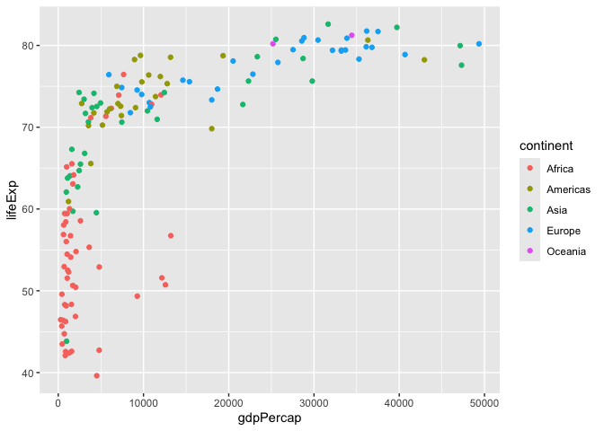

``` r
ggplot(g77)+
  aes(gdpPercap,lifeExp, color=continent)+
  geom_point()
```

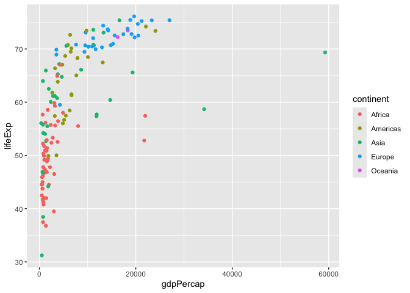

``` r
ggplot(g)+
  aes(gdpPercap,lifeExp, color=continent)+
  geom_point()+
  facet_wrap(~year)
```

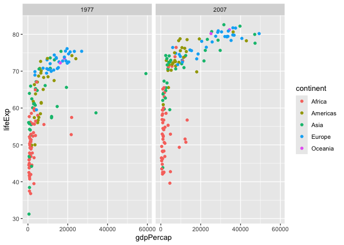

> Q.Make a histogram of lifeExp facetated by continent Q.Make a
> histogram of lifeExp colored by continent (try using `fill=continent`
> or `col=continent`)

``` r
ggplot(gapminder)+
  aes(lifeExp)+
  geom_histogram()
```

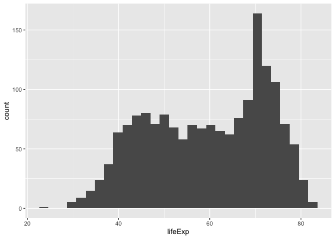

``` r
ggplot(gapminder)+
  aes(lifeExp, col=continent)+
  geom_histogram()
```

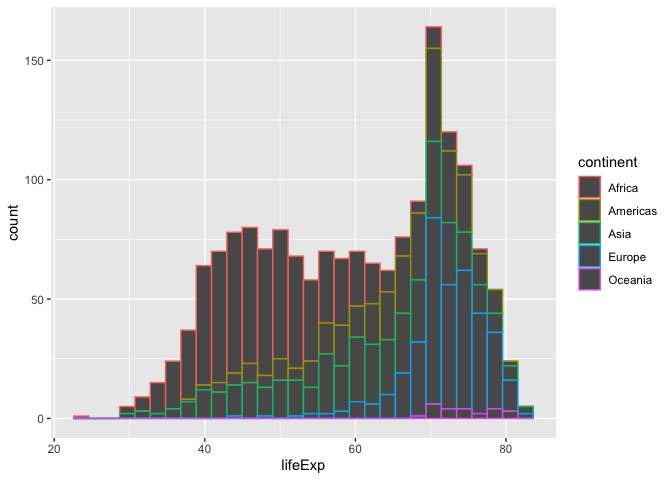

``` r
ggplot(gapminder)+
  aes(lifeExp)+
  geom_histogram()+
  facet_wrap(~continent)
```

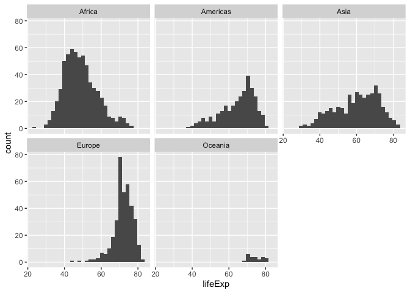
