# Class 07: Machine Learning 01
Ryan Ellis (PID: A17673864)

- [Background](#background)
- [K-means clustering](#k-means-clustering)
- [Hierarchical Clustering](#hierarchical-clustering)
- [Principal Component Analysis
  (PCA)](#principal-component-analysis-pca)
- [Analysis of UK food data](#analysis-of-uk-food-data)
- [Data Import](#data-import)
- [PCA to the rescue](#pca-to-the-rescue)

## Background

Today we will explore some core machine learning methods that are very
popular in bioinformatics. These include **clustering** and
**dimensionallity reduction**.

## K-means clustering

The main function in “base” R for K-means clustering is called
`K-means()`

Before we go to deep, lets use something simple to help us figure out
its function and usage. To accomplish this we use the `rnorm()`
function:

``` r
hist(rnorm(10000,mean=8,sd=6))
```

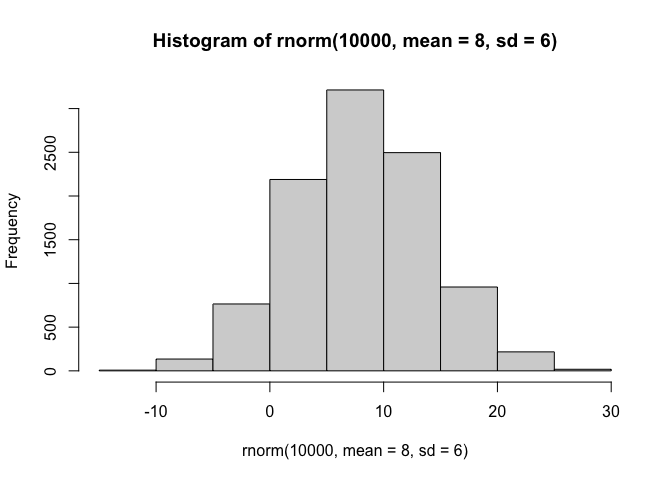

``` r
x <- c( rnorm(30,-3),rnorm(30,3))
x
```

     [1] -3.3960512 -2.1539317 -2.1704954 -2.8942966 -3.9091007 -0.9703679
     [7] -4.8867527 -2.7678628 -5.2732297 -3.1682284 -2.1577479 -4.5892384
    [13] -3.8938332 -4.1482480 -4.0274701 -3.5617036 -3.3374336 -3.3424012
    [19] -3.4444965 -4.4229787 -3.4365483 -2.2710968 -2.6038927 -4.3130195
    [25] -4.8513874 -3.6060752 -2.4609723 -4.1391448 -3.1362729 -3.2619261
    [31]  3.6770899  2.7862735  3.8353547  3.3470090  2.9753385  2.2897617
    [37]  2.2874825  3.1976186  2.9235958  3.2697587  1.8849192  3.3422302
    [43]  2.2769912  3.0305344  0.4369285  2.5688452  2.1924806  2.9049567
    [49]  2.8131378  2.7434220  3.8058929  2.5183307  3.1538435  2.0217646
    [55]  2.0666182  1.5437150  0.8645536  3.1905922  3.0394654  4.5383619

``` r
rev(x)
```

     [1]  4.5383619  3.0394654  3.1905922  0.8645536  1.5437150  2.0666182
     [7]  2.0217646  3.1538435  2.5183307  3.8058929  2.7434220  2.8131378
    [13]  2.9049567  2.1924806  2.5688452  0.4369285  3.0305344  2.2769912
    [19]  3.3422302  1.8849192  3.2697587  2.9235958  3.1976186  2.2874825
    [25]  2.2897617  2.9753385  3.3470090  3.8353547  2.7862735  3.6770899
    [31] -3.2619261 -3.1362729 -4.1391448 -2.4609723 -3.6060752 -4.8513874
    [37] -4.3130195 -2.6038927 -2.2710968 -3.4365483 -4.4229787 -3.4444965
    [43] -3.3424012 -3.3374336 -3.5617036 -4.0274701 -4.1482480 -3.8938332
    [49] -4.5892384 -2.1577479 -3.1682284 -5.2732297 -2.7678628 -4.8867527
    [55] -0.9703679 -3.9091007 -2.8942966 -2.1704954 -2.1539317 -3.3960512

``` r
z<- cbind(x,rev(x))
plot(z)
```

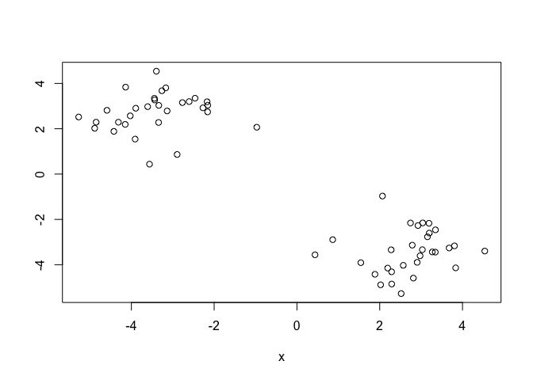

``` r
p<- (1:5)

cbind(p,p)
```

         p p
    [1,] 1 1
    [2,] 2 2
    [3,] 3 3
    [4,] 4 4
    [5,] 5 5

``` r
rbind(p,p)
```

      [,1] [,2] [,3] [,4] [,5]
    p    1    2    3    4    5
    p    1    2    3    4    5

``` r
rev(p)
```

    [1] 5 4 3 2 1

Now we can run `K-means()` on this input `z` and take a look at the
results.

``` r
km<- kmeans(z, centers=2)
km
```

    K-means clustering with 2 clusters of sizes 30, 30

    Cluster means:
              x          
    1 -3.419873  2.717562
    2  2.717562 -3.419873

    Clustering vector:
     [1] 1 1 1 1 1 1 1 1 1 1 1 1 1 1 1 1 1 1 1 1 1 1 1 1 1 1 1 1 1 1 2 2 2 2 2 2 2 2
    [39] 2 2 2 2 2 2 2 2 2 2 2 2 2 2 2 2 2 2 2 2 2 2

    Within cluster sum of squares by cluster:
    [1] 48.5685 48.5685
     (between_SS / total_SS =  92.1 %)

    Available components:

    [1] "cluster"      "centers"      "totss"        "withinss"     "tot.withinss"
    [6] "betweenss"    "size"         "iter"         "ifault"      

``` r
attributes(km)
```

    $names
    [1] "cluster"      "centers"      "totss"        "withinss"     "tot.withinss"
    [6] "betweenss"    "size"         "iter"         "ifault"      

    $class
    [1] "kmeans"

> Q. How many points are in each cluster?

``` r
km$size
```

    [1] 30 30

> Q. What component of your results object details cluster
> assignment/membership?

``` r
km$cluster
```

     [1] 1 1 1 1 1 1 1 1 1 1 1 1 1 1 1 1 1 1 1 1 1 1 1 1 1 1 1 1 1 1 2 2 2 2 2 2 2 2
    [39] 2 2 2 2 2 2 2 2 2 2 2 2 2 2 2 2 2 2 2 2 2 2

> Q. What component of your results object details cluster centers?

``` r
km$centers
```

              x          
    1 -3.419873  2.717562
    2  2.717562 -3.419873

> Q. Plot `z` colored by the kmeans cluster assignment and add cluster
> centers as blue points?

``` r
plot(z,col=c("red","blue"))
```

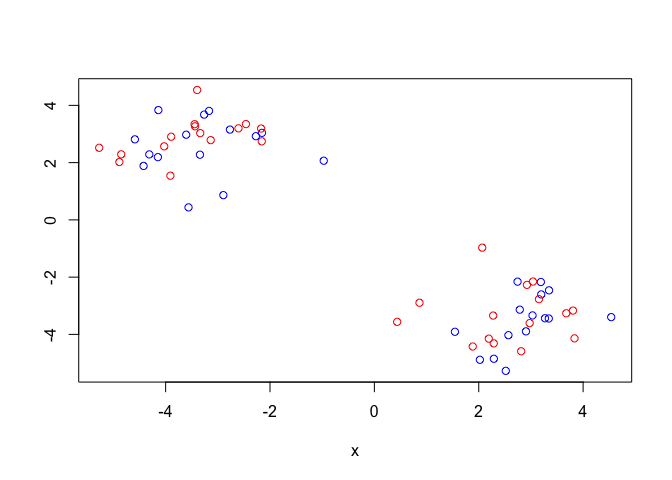

``` r
plot(z,col=km$cluster)
points(km$centers, col="blue", pch=15)
```

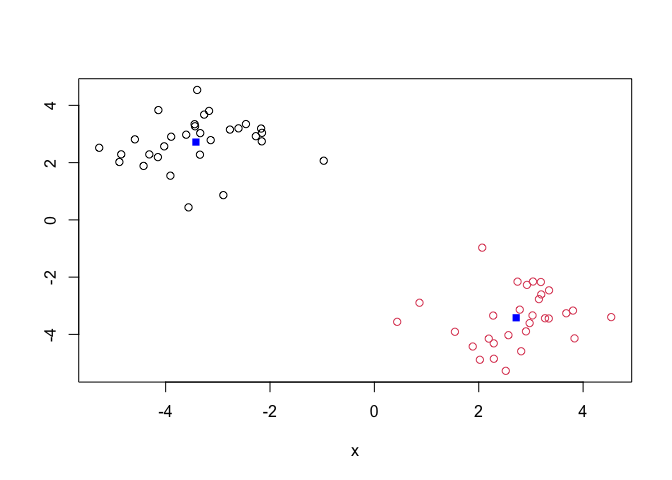

> Q. Run a K-means clustering and plot the results asking for 4 clusters
> (k=4)?

``` r
km_4<- kmeans(z, centers=4)
km_4
```

    K-means clustering with 4 clusters of sizes 10, 12, 8, 30

    Cluster means:
              x          
    1 -3.482001  3.416579
    2 -4.184986  1.974909
    3 -2.194546  2.957771
    4  2.717562 -3.419873

    Clustering vector:
     [1] 1 3 3 2 2 3 2 3 2 1 3 2 1 2 2 2 1 2 1 2 1 3 3 2 2 1 3 1 1 1 4 4 4 4 4 4 4 4
    [39] 4 4 4 4 4 4 4 4 4 4 4 4 4 4 4 4 4 4 4 4 4 4

    Within cluster sum of squares by cluster:
    [1]  3.598063 10.704493  3.224918 48.568499
     (between_SS / total_SS =  94.6 %)

    Available components:

    [1] "cluster"      "centers"      "totss"        "withinss"     "tot.withinss"
    [6] "betweenss"    "size"         "iter"         "ifault"      

``` r
plot(z,col=km_4$cluster)
points(km_4$centers, col="black", pch=15)
```

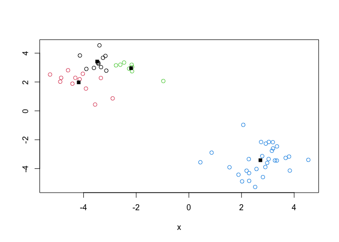

> **N.R** You need to tell K-means the number of clusters (ie set the
> `centers=2`)!!

One approach is to try some values for centers and then pick the best
one..

``` r
ans<- NULL 
for(i in 1:10){
km<- kmeans(z, centers=i)
ans <- c(ans,km$tot.withinss)
}

plot(ans, typ="o", xlab= "Number of clusters", ylab="The sum of squares Distance")
```

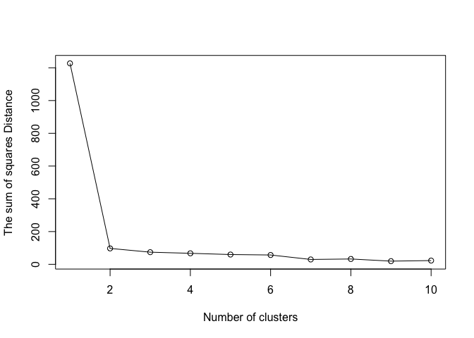

## Hierarchical Clustering

The main function in “base” R for Hierarchical Clustering is called
`hclust()`

This function does not take your “raw” data for clustering. You must
first build a “distance matrix” from your data and pass it as input to
`hclust()`

``` r
d<- dist(z)
hc<- hclust(d)
hc
```


    Call:
    hclust(d = d)

    Cluster method   : complete 
    Distance         : euclidean 
    Number of objects: 60 

there is a seperate `plot()` for each `hclust()` result object.

``` r
plot(hc)
abline(h=8, col="red")
```

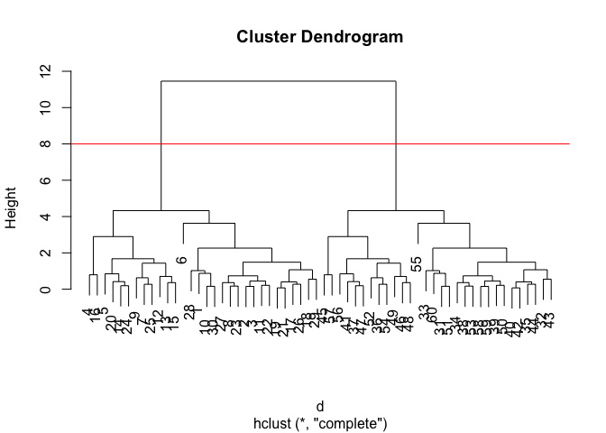

Once we have the `hclust()` object (the tree of the cluster dendrogram)
we can then **cut** the tree to reveal the clustering pattern.

``` r
cutree(hc, h=8)
```

     [1] 1 1 1 1 1 1 1 1 1 1 1 1 1 1 1 1 1 1 1 1 1 1 1 1 1 1 1 1 1 1 2 2 2 2 2 2 2 2
    [39] 2 2 2 2 2 2 2 2 2 2 2 2 2 2 2 2 2 2 2 2 2 2

can cut the tree so that we are left with 4 groups (k=4)

``` r
j <-cutree(hc, k=2)
```

> Q. Make a plot of `z` with you `hclust()` results (i.e colored by
> clustermemberhsip)

``` r
plot(z, col=j)
```

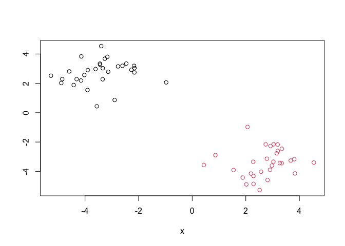

## Principal Component Analysis (PCA)

PCA is a dimensionallity reduction method that is popular for revealing
patterns in complex datasets.

## Analysis of UK food data

Let’s look at some data on the eating habits of people from the UK to
see if there are any patterns or trends that have some regions being
distinct from others.

## Data Import

The data is made available in CSV format so we can use the `read.csv()`
function

``` r
url <- "https://tinyurl.com/UK-foods"
x <- read.csv(url)
```

> Q. Q1. How many rows and columns are in your new data frame named x?
> What R functions could you use to answer this questions?

``` r
nrow(x)
```

    [1] 17

``` r
ncol(x)
```

    [1] 5

``` r
dim(x)
```

    [1] 17  5

> Q2. Which approach to solving the ‘row-names problem’ mentioned above
> do you prefer and why? Is one approach more robust than another under
> certain circumstances?

``` r
url <- "https://tinyurl.com/UK-foods"
x <- read.csv(url, row.names=1)
```

``` r
dim(x)
```

    [1] 17  4

The approach of hardcoding into the `read.csv()` function I prefer, as
it is more streamlined and robust.The \[-1\] index method requires more
line of code.

``` r
# Using base R
barplot(as.matrix(x), beside=T, col=rainbow(nrow(x)))
```


``` r
?barplot()
```

> Q3: Changing what optional argument in the above barplot() function
> results in the following plot?

``` r
barplot(as.matrix(x), beside=FALSE, col=rainbow(nrow(x)))
```

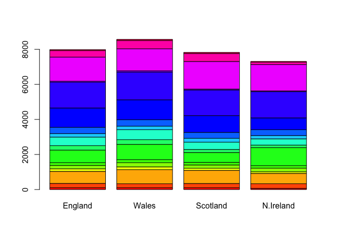

By changing the argument inside `barplot()` –\> beside from true to
false will change whether the bars are stacked or juxtaposed.

``` r
library(ggplot2)
```

``` r
library(tidyr)

# Convert data to long format for ggplot with `pivot_longer()`
x_long <- x |> 
          tibble::rownames_to_column("Food") |> 
          pivot_longer(cols = -Food, 
                       names_to = "Country", 
                       values_to = "Consumption")

dim(x_long)
```

    [1] 68  3

``` r
ggplot(x_long) +
  aes(x = Country, y = Consumption, fill = Food) +
  geom_col(position = "dodge") +
  theme_bw()
```

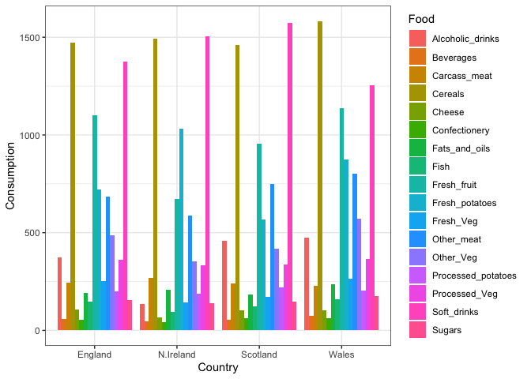

> Q4: Changing what optional argument in the above ggplot() code results
> in a stacked barplot figure?

``` r
ggplot(x_long) +
  aes(x = Country, y = Consumption, fill = Food) +
  geom_col() +
  theme_bw()
```

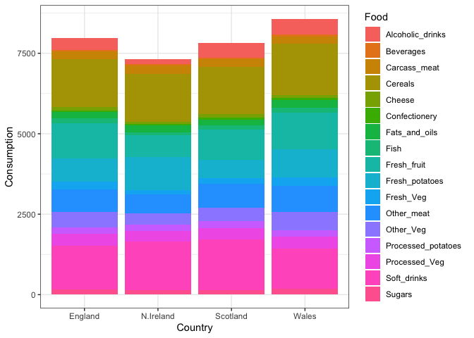

Via deletion of the position:‘dodge’ in the `geom_col()` layer of
`ggplot()`, this will change the columns into a stacked manner rather
than juxtaposed.

> Q5: We can use the pairs() function to generate all pairwise plots for
> our countries. Can you make sense of the following code and resulting
> figure? What does it mean if a given point lies on the diagonal for a
> given plot?

``` r
pairs(x, col=rainbow(nrow(x)), pch=16)
```

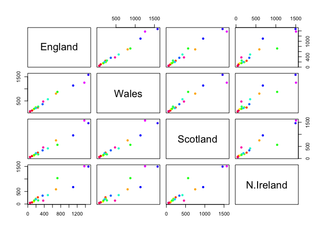

If a data point lies on a diagonal line, this would indicate that within
each country they ingest the same amount of that particular food. If it
is outlier depending on the direction there is a discrepancy between the
two countries.

``` r
library(pheatmap)

pheatmap( as.matrix(x))
```

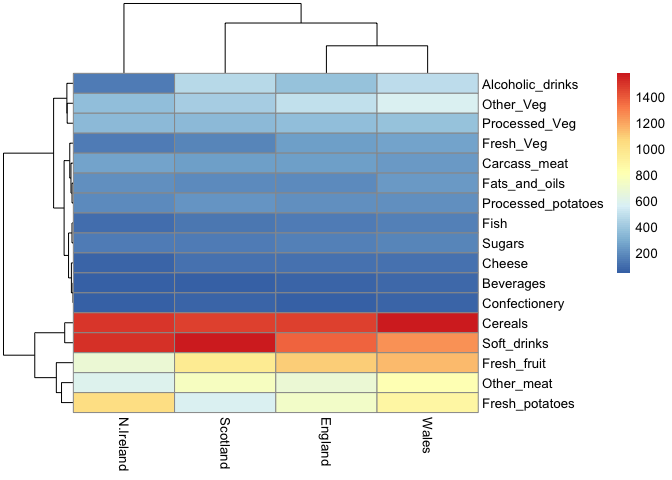

> Q6. Based on the pairs and heatmap figures, which countries cluster
> together and what does this suggest about their food consumption
> patterns? Can you easily tell what the main differences between N.
> Ireland and the other countries of the UK in terms of this data-set?

> **KEY POINT** can still be challenging to intrepret!

## PCA to the rescue

The main function in “base” R for PCA is called `prcomp()`. This
function wants wants the *observations* to be rows and the *variables*
to columns. Need to transpose our data, use `t()`.

``` r
pca<- prcomp(t(x))
summary(pca)
```

    Importance of components:
                                PC1      PC2      PC3       PC4
    Standard deviation     324.1502 212.7478 73.87622 2.921e-14
    Proportion of Variance   0.6744   0.2905  0.03503 0.000e+00
    Cumulative Proportion    0.6744   0.9650  1.00000 1.000e+00

The return `pca` object has components that we can use to make our main
results figures:

``` r
attributes(pca)
```

    $names
    [1] "sdev"     "rotation" "center"   "scale"    "x"       

    $class
    [1] "prcomp"

The main result figure form this analysis is called a **“PC score
plot”** or “ordination plot” “PC plot” or PC1 versus PC2 plot.

This plot shows how samples (in this case countries) relate to each
other along our new PC axis.

``` r
mycols<- c("orange", "red", "blue", "green")
pca$x
```

                     PC1         PC2        PC3           PC4
    England   -144.99315   -2.532999 105.768945 -9.152022e-15
    Wales     -240.52915 -224.646925 -56.475555  5.560040e-13
    Scotland   -91.86934  286.081786 -44.415495 -6.638419e-13
    N.Ireland  477.39164  -58.901862  -4.877895  1.329771e-13

``` r
ggplot(pca$x)+ 
  aes(PC1, PC2)+
geom_point(colour = mycols)
```

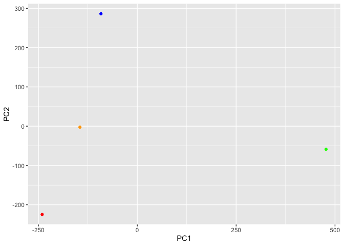

``` r
ggplot(pca$x)+ 
  aes(PC1, PC2, label=row.names(pca$x))+
geom_point(col=mycols)+
  geom_text(size=3,vjust=2, col=mycols)
```

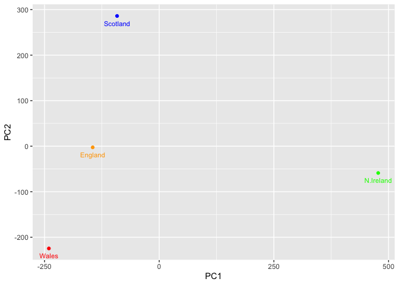

``` r
pca$rotation
```

                                 PC1          PC2         PC3          PC4
    Cheese              -0.056955380  0.016012850  0.02394295 -0.409382587
    Carcass_meat         0.047927628  0.013915823  0.06367111  0.729481922
    Other_meat          -0.258916658 -0.015331138 -0.55384854  0.331001134
    Fish                -0.084414983 -0.050754947  0.03906481  0.022375878
    Fats_and_oils       -0.005193623 -0.095388656 -0.12522257  0.034512161
    Sugars              -0.037620983 -0.043021699 -0.03605745  0.024943337
    Fresh_potatoes       0.401402060 -0.715017078 -0.20668248  0.021396007
    Fresh_Veg           -0.151849942 -0.144900268  0.21382237  0.001606882
    Other_Veg           -0.243593729 -0.225450923 -0.05332841  0.031153231
    Processed_potatoes  -0.026886233  0.042850761 -0.07364902 -0.017379680
    Processed_Veg       -0.036488269 -0.045451802  0.05289191  0.021250980
    Fresh_fruit         -0.632640898 -0.177740743  0.40012865  0.227657348
    Cereals             -0.047702858 -0.212599678 -0.35884921  0.100043319
    Beverages           -0.026187756 -0.030560542 -0.04135860 -0.018382072
    Soft_drinks          0.232244140  0.555124311 -0.16942648  0.222319484
    Alcoholic_drinks    -0.463968168  0.113536523 -0.49858320 -0.273126013
    Confectionery       -0.029650201  0.005949921 -0.05232164  0.001890737

``` r
#how the individual variables contribute to the PCA
ggplot(pca$rotation)+
  aes(PC1, row.names(pca$rotation))+
  geom_col()
```

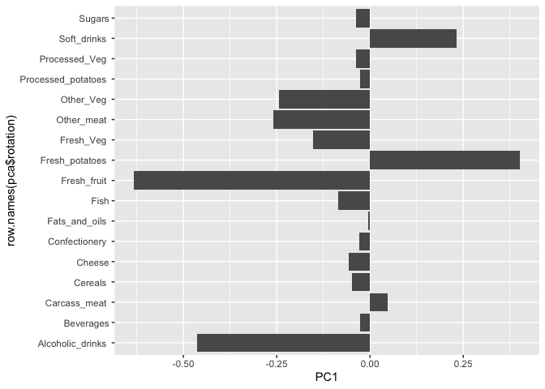

The loading plot will show you how the different countries (variables)
are different and in what manner they are different. For example N
Ireland is highly different than the other 3 in terms of PCA 1. The
score plot (second)shows how the variables (food) play a role in the PCA
scores, for example in Northern Ireland it is shown that they ingest
more potatoes and soft drinks than the other three, because it have a
more positive PCA 1 score.
