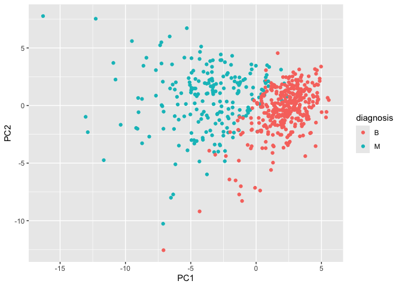
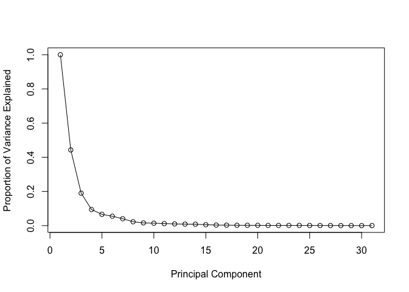
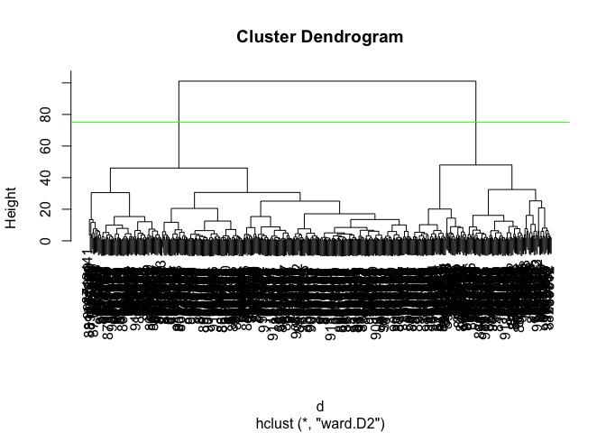
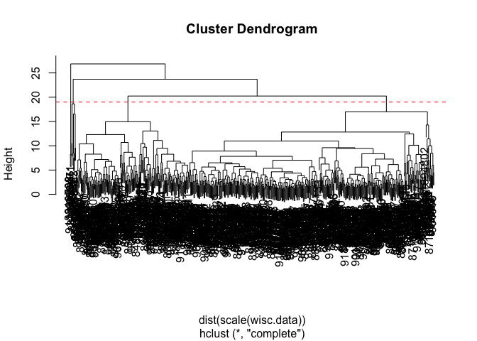
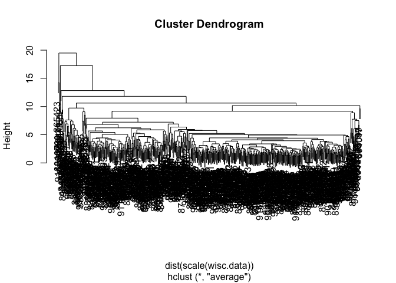
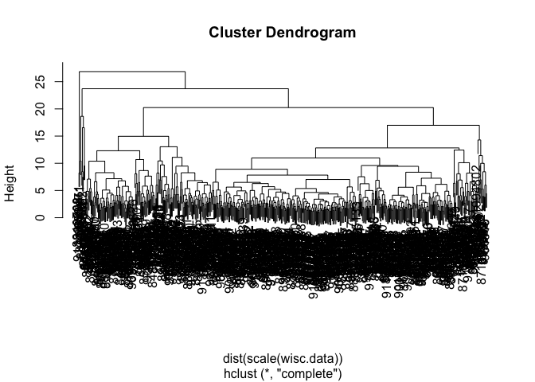
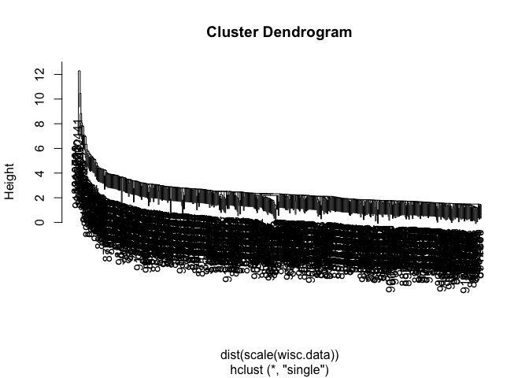
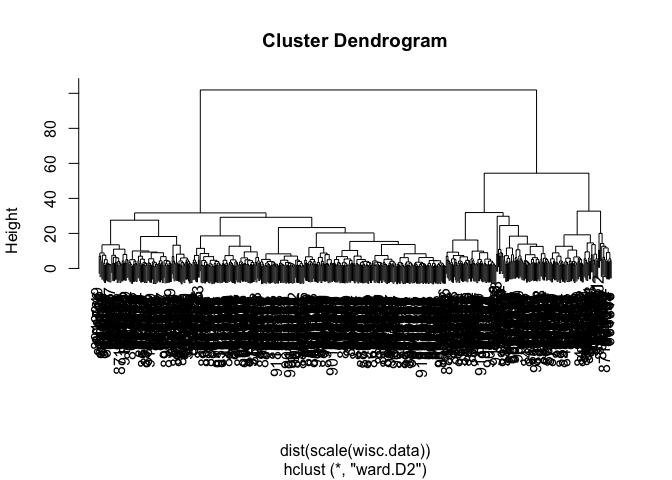
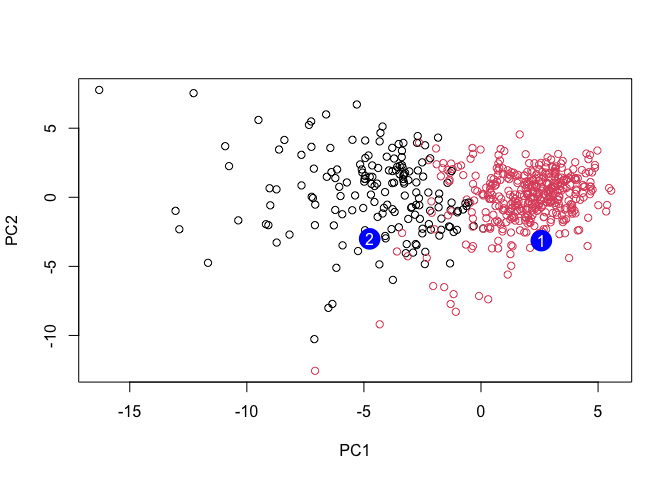

# Class 08: Breast Cancer Mini Proj
Ryan Ellis (PID: A17673864)

- [Background](#background)
- [Data Import](#data-import)
- [Exploratory Data Analysis](#exploratory-data-analysis)
- [Principle Component Analysis
  (PCA)](#principle-component-analysis-pca)
- [Lets visualize](#lets-visualize)
- [Varaince](#varaince)
- [Commuicating PCA Results](#commuicating-pca-results)
- [Hierarchical Clustering](#hierarchical-clustering)
- [Combine Methods](#combine-methods)
- [Prediction](#prediction)

## Background

The goal of this mini-project is for you to explore a complete analysis
using the unsupervised learning techniques covered in class.

We will analyze a data set describing a fine needle aspiration (FNA) of
a breast mass.

## Data Import

The data is made available as a CSV file for download. We can use the
`read.csv()` function:

``` r
# IMPORTANT TO SET ROW NAMES EQUAL TO ONE
wisc.df<- read.csv("WisconsinCancer.csv", row.names=1)
```

``` r
head(wisc.df, 3)
```

             diagnosis radius_mean texture_mean perimeter_mean area_mean
    842302           M       17.99        10.38          122.8      1001
    842517           M       20.57        17.77          132.9      1326
    84300903         M       19.69        21.25          130.0      1203
             smoothness_mean compactness_mean concavity_mean concave.points_mean
    842302           0.11840          0.27760         0.3001             0.14710
    842517           0.08474          0.07864         0.0869             0.07017
    84300903         0.10960          0.15990         0.1974             0.12790
             symmetry_mean fractal_dimension_mean radius_se texture_se perimeter_se
    842302          0.2419                0.07871    1.0950     0.9053        8.589
    842517          0.1812                0.05667    0.5435     0.7339        3.398
    84300903        0.2069                0.05999    0.7456     0.7869        4.585
             area_se smoothness_se compactness_se concavity_se concave.points_se
    842302    153.40      0.006399        0.04904      0.05373           0.01587
    842517     74.08      0.005225        0.01308      0.01860           0.01340
    84300903   94.03      0.006150        0.04006      0.03832           0.02058
             symmetry_se fractal_dimension_se radius_worst texture_worst
    842302       0.03003             0.006193        25.38         17.33
    842517       0.01389             0.003532        24.99         23.41
    84300903     0.02250             0.004571        23.57         25.53
             perimeter_worst area_worst smoothness_worst compactness_worst
    842302             184.6       2019           0.1622            0.6656
    842517             158.8       1956           0.1238            0.1866
    84300903           152.5       1709           0.1444            0.4245
             concavity_worst concave.points_worst symmetry_worst
    842302            0.7119               0.2654         0.4601
    842517            0.2416               0.1860         0.2750
    84300903          0.4504               0.2430         0.3613
             fractal_dimension_worst
    842302                   0.11890
    842517                   0.08902
    84300903                 0.08758

We need to exclude the `diagnosis` column for analysis as this is the
answer we are trying to achieve.

``` r
# This will give us everything but the first column
wisc.data <- wisc.df[,-1]
diagnosis<- as.factor(wisc.df$diagnosis)
```

## Exploratory Data Analysis

> Q1. How many observations are in this dataset?

``` r
nrow(wisc.df)
```

    [1] 569

There are 569 patients or observations.

> Q2. How many of the observations have a malignant diagnosis?

``` r
table(diagnosis)
```

    diagnosis
      B   M 
    357 212 

There are 357 benign and 212 are malignant.

> Q3. How many variables/features in the data are suffixed with \_mean?

We can use the `grep()` function:

``` r
colnames(wisc.data)
```

     [1] "radius_mean"             "texture_mean"           
     [3] "perimeter_mean"          "area_mean"              
     [5] "smoothness_mean"         "compactness_mean"       
     [7] "concavity_mean"          "concave.points_mean"    
     [9] "symmetry_mean"           "fractal_dimension_mean" 
    [11] "radius_se"               "texture_se"             
    [13] "perimeter_se"            "area_se"                
    [15] "smoothness_se"           "compactness_se"         
    [17] "concavity_se"            "concave.points_se"      
    [19] "symmetry_se"             "fractal_dimension_se"   
    [21] "radius_worst"            "texture_worst"          
    [23] "perimeter_worst"         "area_worst"             
    [25] "smoothness_worst"        "compactness_worst"      
    [27] "concavity_worst"         "concave.points_worst"   
    [29] "symmetry_worst"          "fractal_dimension_worst"

``` r
length(grep("_mean",colnames(wisc.data)))
```

    [1] 10

There are 10 variables with `_mean`

## Principle Component Analysis (PCA)

Need to scale data before PCA. `scale=TRUE` in the argument of
`prcomp()`.

``` r
## In general will always want to include scaling, will make the plots easier to interpret and present 

wisc.pr<- prcomp(wisc.data, scale=TRUE)
summary(wisc.pr)
```

    Importance of components:
                              PC1    PC2     PC3     PC4     PC5     PC6     PC7
    Standard deviation     3.6444 2.3857 1.67867 1.40735 1.28403 1.09880 0.82172
    Proportion of Variance 0.4427 0.1897 0.09393 0.06602 0.05496 0.04025 0.02251
    Cumulative Proportion  0.4427 0.6324 0.72636 0.79239 0.84734 0.88759 0.91010
                               PC8    PC9    PC10   PC11    PC12    PC13    PC14
    Standard deviation     0.69037 0.6457 0.59219 0.5421 0.51104 0.49128 0.39624
    Proportion of Variance 0.01589 0.0139 0.01169 0.0098 0.00871 0.00805 0.00523
    Cumulative Proportion  0.92598 0.9399 0.95157 0.9614 0.97007 0.97812 0.98335
                              PC15    PC16    PC17    PC18    PC19    PC20   PC21
    Standard deviation     0.30681 0.28260 0.24372 0.22939 0.22244 0.17652 0.1731
    Proportion of Variance 0.00314 0.00266 0.00198 0.00175 0.00165 0.00104 0.0010
    Cumulative Proportion  0.98649 0.98915 0.99113 0.99288 0.99453 0.99557 0.9966
                              PC22    PC23   PC24    PC25    PC26    PC27    PC28
    Standard deviation     0.16565 0.15602 0.1344 0.12442 0.09043 0.08307 0.03987
    Proportion of Variance 0.00091 0.00081 0.0006 0.00052 0.00027 0.00023 0.00005
    Cumulative Proportion  0.99749 0.99830 0.9989 0.99942 0.99969 0.99992 0.99997
                              PC29    PC30
    Standard deviation     0.02736 0.01153
    Proportion of Variance 0.00002 0.00000
    Cumulative Proportion  1.00000 1.00000

> Q4. From your results, what proportion of the original variance is
> captured by the first principal component (PC1)?

Around 44.27% of the data is captured via PC1

> Q5. How many principal components (PCs) are required to describe at
> least 70% of the original variance in the data?

To describe 70% of the data you need at least the first three PC’s so
PC1-PC3

> Q6. How many principal components (PCs) are required to describe at
> least 90% of the original variance in the data?

To get to 90% cumulative proportion it is necessary to have 7 principal
components (PC1-PC7)

## Lets visualize

``` r
biplot(wisc.pr)
```


> Q7. What stands out to you about this plot? Is it easy or difficult to
> understand? Why?

The sheer amount of data that this plot is trying to visualize. It is
extremely difficult to visualize much of anything within the plot due to
the number of points and different thing occurring.

``` r
library(ggplot2)
ggplot(wisc.pr$x)+
  aes(PC1, PC2, col=diagnosis)+
  geom_point()
```



> Q8. Generate a similar plot for principal components 1 and 3. What do
> you notice about these plots?

That both PC1/PC2 and PC1/PC3 are separated via diagnosis on PC1 axis,
but both heavily overlap in PC2 and PC3. PC1 captures the most amount of
variance.

``` r
ggplot(wisc.pr$x)+
  aes(PC1, PC3, col=diagnosis)+
  geom_point()
```


## Varaince

We will make a scree plot, which will show us the variance that each PC
indicates. Basically creates a exponential graph (hill), that will show
when adding new PC’s doesn’t really make sense anymore.

``` r
pr.var<-(wisc.pr$sdev^2)
```

``` r
pve<- ((pr.var)/(30))

plot(c(1,pve), xlab = "Principal Component", 
     ylab = "Proportion of Variance Explained", 
     ylim = c(0, 1), type = "o")
```



## Commuicating PCA Results

> Q9. For the first principal component, what is the component of the
> loading vector (i.e. wisc.pr\$rotation\[,1\]) for the feature
> concave.points_mean? This tells us how much this original feature
> contributes to the first PC. Are there any features with larger
> contributions than this one?

``` r
wisc.pr$rotation[,1]
```

                radius_mean            texture_mean          perimeter_mean 
                -0.21890244             -0.10372458             -0.22753729 
                  area_mean         smoothness_mean        compactness_mean 
                -0.22099499             -0.14258969             -0.23928535 
             concavity_mean     concave.points_mean           symmetry_mean 
                -0.25840048             -0.26085376             -0.13816696 
     fractal_dimension_mean               radius_se              texture_se 
                -0.06436335             -0.20597878             -0.01742803 
               perimeter_se                 area_se           smoothness_se 
                -0.21132592             -0.20286964             -0.01453145 
             compactness_se            concavity_se       concave.points_se 
                -0.17039345             -0.15358979             -0.18341740 
                symmetry_se    fractal_dimension_se            radius_worst 
                -0.04249842             -0.10256832             -0.22799663 
              texture_worst         perimeter_worst              area_worst 
                -0.10446933             -0.23663968             -0.22487053 
           smoothness_worst       compactness_worst         concavity_worst 
                -0.12795256             -0.21009588             -0.22876753 
       concave.points_worst          symmetry_worst fractal_dimension_worst 
                -0.25088597             -0.12290456             -0.13178394 

The proportional component of PC1 that is `concave.points_mean` is
-.261, and there is no other component with as much magnitude. This
means that this feature has the biggest influence on where the point
(patient) is placed in the PC1 axis.

## Hierarchical Clustering

``` r
wisc.hclust <- hclust(dist(scale(wisc.data)))
plot(wisc.hclust)
```


## Combine Methods

``` r
d<-dist(wisc.pr$x[,1:4])
wisc.pr.hclust<- hclust(d, method="ward.D2")
plot(wisc.pr.hclust)
abline(h=75, col="green")
```



``` r
grps<- cutree(wisc.pr.hclust, h=75)
table(grps)
```

    grps
      1   2 
    171 398 

``` r
# These results are similar to the diagnosis, where we cluster the two groups into Malignant and Beningn
```

How does this clustering in `grps()` correspond to the expert
`diagnosis`

``` r
table(diagnosis)
```

    diagnosis
      B   M 
    357 212 

``` r
table(diagnosis, grps)
```

             grps
    diagnosis   1   2
            B   6 351
            M 165  47

> Q10. Using the plot() and abline() functions, what is the height at
> which the clustering model has 4 clusters?

``` r
plot(wisc.hclust)
abline(h=19, col="red", lty=2)
```



The hieght at which the normal clustering model has 4 clusters without
PCA is around 19.

> Q12. Which method gives your favorite results for the same data.dist
> dataset? Explain your reasoning.

``` r
method.hclust<- hclust(dist(scale(wisc.data)), method="average")
plot(method.hclust)
```



``` r
method.hclust<- hclust(dist(scale(wisc.data)), method="complete")
plot(method.hclust)
```



``` r
method.hclust<- hclust(dist(scale(wisc.data)), method="single")
plot(method.hclust)
```



``` r
method.hclust<- hclust(dist(scale(wisc.data)), method="ward.D2")
plot(method.hclust)
```



The best method is `ward.D2`, also average is alright. They both aim to
spread the data put so it is easier to interpret the clusters. but
`ward.D2` does a much better job of this when looking at the above plots
of the different methods.

> Q13. How well does the newly created hclust model with two clusters
> separate out the two “M” and “B” diagnoses?

It does decently when we compare it to the expert diagnosis, it shows
that we have 6 false positive for benign and 47 false negatives for
malignant. This is shown in the table above plotted grps versus
diagnosis.

> Q14. How well do the hierarchical clustering models you created in the
> previous sections (i.e. without first doing PCA) do in terms of
> separating the diagnoses? Again, use the table() function to compare
> the output of each model (wisc.hclust.clusters and
> wisc.pr.hclust.clusters) with the vector containing the actual
> diagnoses.

``` r
wisc.hclust.clusters <- cutree(wisc.hclust, k=2)
table(diagnosis,wisc.hclust.clusters)
```

             wisc.hclust.clusters
    diagnosis   1   2
            B 357   0
            M 210   2

Before using PCA, we can see that there is almost no separation between
the two types, benign and malignant. Although when using PCA we have
some false negative and positives, without it we cant really even
interpret anything.

## Prediction

We will now utilize the `predict()` function to combine our previous PCA
model and and some new data (cancer cell data)

``` r
url <- "https://tinyurl.com/new-samples-CSV"
new <- read.csv(url)
npc <- predict(wisc.pr, newdata=new)
npc
```

               PC1       PC2        PC3        PC4       PC5        PC6        PC7
    [1,]  2.576616 -3.135913  1.3990492 -0.7631950  2.781648 -0.8150185 -0.3959098
    [2,] -4.754928 -3.009033 -0.1660946 -0.6052952 -1.140698 -1.2189945  0.8193031
                PC8       PC9       PC10      PC11      PC12      PC13     PC14
    [1,] -0.2307350 0.1029569 -0.9272861 0.3411457  0.375921 0.1610764 1.187882
    [2,] -0.3307423 0.5281896 -0.4855301 0.7173233 -1.185917 0.5893856 0.303029
              PC15       PC16        PC17        PC18        PC19       PC20
    [1,] 0.3216974 -0.1743616 -0.07875393 -0.11207028 -0.08802955 -0.2495216
    [2,] 0.1299153  0.1448061 -0.40509706  0.06565549  0.25591230 -0.4289500
               PC21       PC22       PC23       PC24        PC25         PC26
    [1,]  0.1228233 0.09358453 0.08347651  0.1223396  0.02124121  0.078884581
    [2,] -0.1224776 0.01732146 0.06316631 -0.2338618 -0.20755948 -0.009833238
                 PC27        PC28         PC29         PC30
    [1,]  0.220199544 -0.02946023 -0.015620933  0.005269029
    [2,] -0.001134152  0.09638361  0.002795349 -0.019015820

``` r
plot(wisc.pr$x[,1:2], col=grps)
points(npc[,1], npc[,2], col="blue", pch=16, cex=3)
text(npc[,1], npc[,2], c(1,2), col="white")
```



> Q16. Which of these new patients should we prioritize for follow up
> based on your results?

When viewing the plot, and based off the previous conclusions drawn from
the PCA plots, a malignant patient(tumor), is likely to be in the
negative portion on the x axis (PC1). Thus when comparing patient 1 and
2 because patient 2 lies on the negative side amoungst the malignant
patients I would predict this patient to be prioritized.
