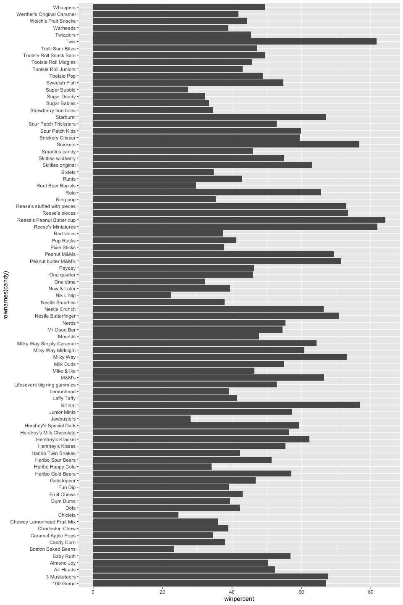
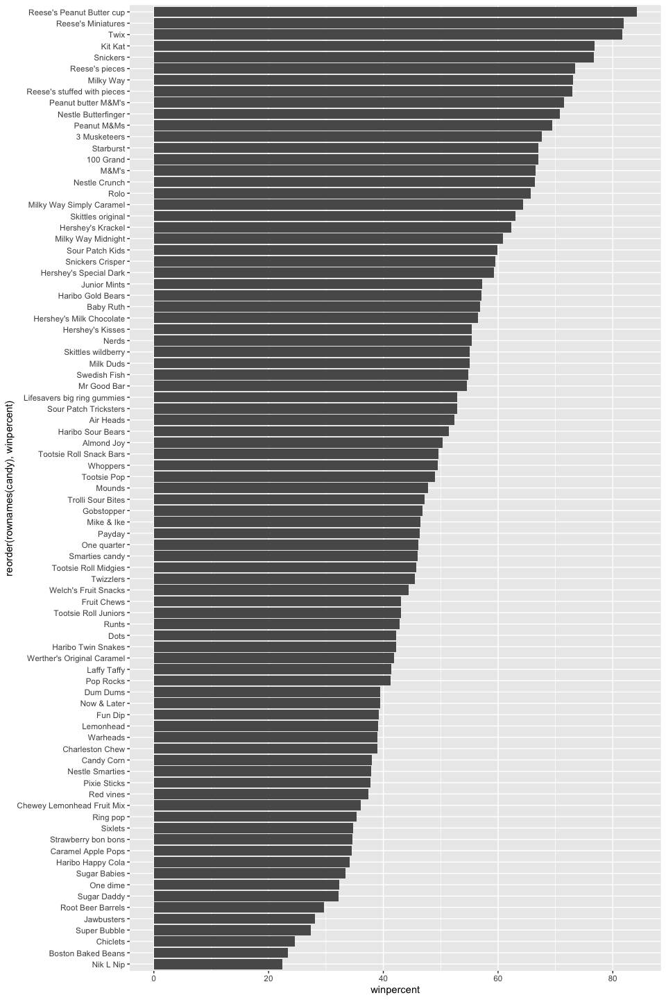
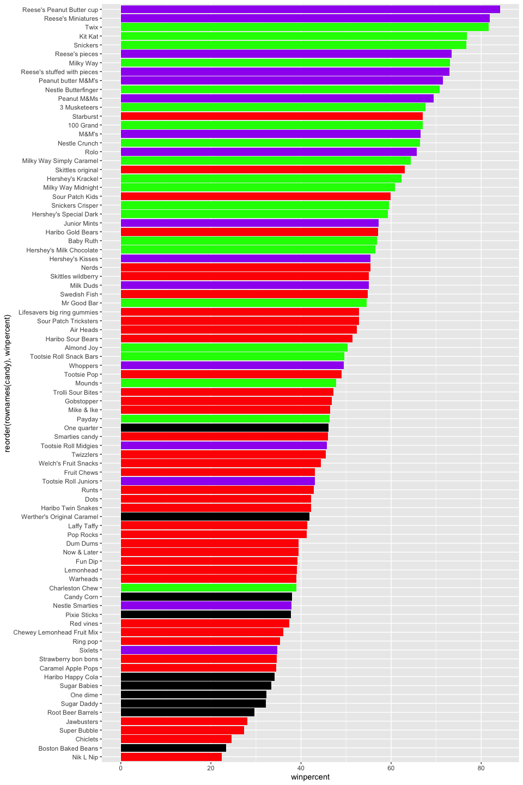
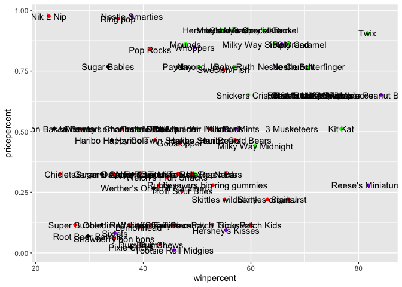
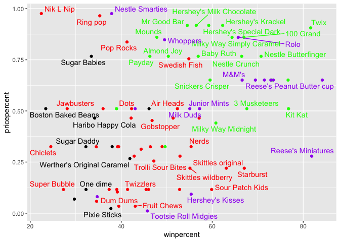
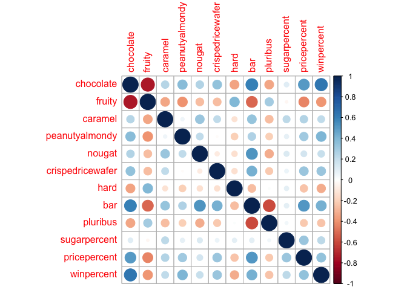
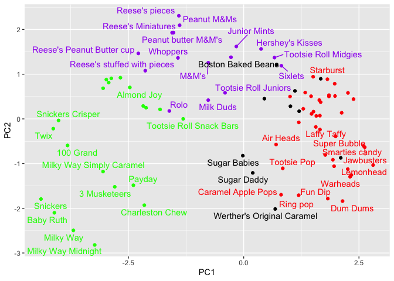
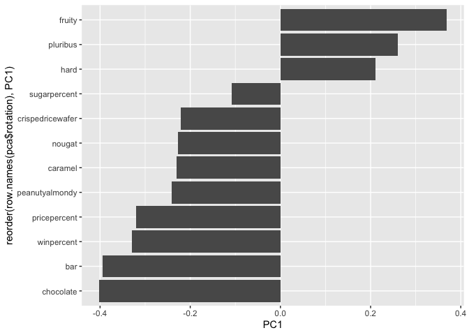

# Class 09: Candy Mini-Project
Ryan Ellis (PID: A17673864)

- [Background](#background)
- [What is your favorite candy?](#what-is-your-favorite-candy)
- [Exploratory Analysis](#exploratory-analysis)
- [Overall Candy Rankings](#overall-candy-rankings)
- [Adding Color](#adding-color)
- [Taking a look at pricepercent](#taking-a-look-at-pricepercent)
- [Exploring the correlation
  structure](#exploring-the-correlation-structure)
- [Principal Component Analysis
  (PCA)](#principal-component-analysis-pca)

## Background

In this mini project we will take a dive into some exploratory
techniques within `r`, including creating correlation plots and PCA
plots to explore and intrepret a dataset on candy.

``` r
candydata<- "candy-data.csv"
candy = read.csv(candydata, row.names=1)
head(candy)
```

                 chocolate fruity caramel peanutyalmondy nougat crispedricewafer
    100 Grand            1      0       1              0      0                1
    3 Musketeers         1      0       0              0      1                0
    One dime             0      0       0              0      0                0
    One quarter          0      0       0              0      0                0
    Air Heads            0      1       0              0      0                0
    Almond Joy           1      0       0              1      0                0
                 hard bar pluribus sugarpercent pricepercent winpercent
    100 Grand       0   1        0        0.732        0.860   66.97173
    3 Musketeers    0   1        0        0.604        0.511   67.60294
    One dime        0   0        0        0.011        0.116   32.26109
    One quarter     0   0        0        0.011        0.511   46.11650
    Air Heads       0   0        0        0.906        0.511   52.34146
    Almond Joy      0   1        0        0.465        0.767   50.34755

> Q1. How many different candy types are in this dataset?

``` r
nrow(candy)
```

    [1] 85

> Q2. How many fruity candy types are in the dataset?

``` r
table(candy$fruity)
```


     0  1 
    47 38 

There are 38 different fruity types of candy.

## What is your favorite candy?

The percentage of people who prefer a certain candy over a randomly
chosen one is called `$winpercent`.

> Q3. What is your favorite candy (other than Twix) in the dataset and
> what is it’s winpercent value?

``` r
candy["Milky Way", ]$winpercent
```

    [1] 73.09956

The winpercent value for Milky Way is 73%

> Q4. What is the winpercent value for “Kit Kat”?

``` r
candy["Kit Kat", ]$winpercent
```

    [1] 76.7686

The winpercent for Kit Kat is around 77%

> Q5. What is the winpercent value for “Tootsie Roll Snack Bars”?

``` r
candy["Tootsie Roll Snack Bars", ]$winpercent
```

    [1] 49.6535

The winpercent for Tootsie Roll Snack Bars is around 50%

Now we will dive into the `skim()` function that is apart of the
**skimr** package. This helps to summarize and overview the dataset.

``` r
skimr::skim(candy)
```

|                                                  |       |
|:-------------------------------------------------|:------|
| Name                                             | candy |
| Number of rows                                   | 85    |
| Number of columns                                | 12    |
| \_\_\_\_\_\_\_\_\_\_\_\_\_\_\_\_\_\_\_\_\_\_\_   |       |
| Column type frequency:                           |       |
| numeric                                          | 12    |
| \_\_\_\_\_\_\_\_\_\_\_\_\_\_\_\_\_\_\_\_\_\_\_\_ |       |
| Group variables                                  | None  |

Data summary

**Variable type: numeric**

| skim_variable | n_missing | complete_rate | mean | sd | p0 | p25 | p50 | p75 | p100 | hist |
|:---|---:|---:|---:|---:|---:|---:|---:|---:|---:|:---|
| chocolate | 0 | 1 | 0.44 | 0.50 | 0.00 | 0.00 | 0.00 | 1.00 | 1.00 | ▇▁▁▁▆ |
| fruity | 0 | 1 | 0.45 | 0.50 | 0.00 | 0.00 | 0.00 | 1.00 | 1.00 | ▇▁▁▁▆ |
| caramel | 0 | 1 | 0.16 | 0.37 | 0.00 | 0.00 | 0.00 | 0.00 | 1.00 | ▇▁▁▁▂ |
| peanutyalmondy | 0 | 1 | 0.16 | 0.37 | 0.00 | 0.00 | 0.00 | 0.00 | 1.00 | ▇▁▁▁▂ |
| nougat | 0 | 1 | 0.08 | 0.28 | 0.00 | 0.00 | 0.00 | 0.00 | 1.00 | ▇▁▁▁▁ |
| crispedricewafer | 0 | 1 | 0.08 | 0.28 | 0.00 | 0.00 | 0.00 | 0.00 | 1.00 | ▇▁▁▁▁ |
| hard | 0 | 1 | 0.18 | 0.38 | 0.00 | 0.00 | 0.00 | 0.00 | 1.00 | ▇▁▁▁▂ |
| bar | 0 | 1 | 0.25 | 0.43 | 0.00 | 0.00 | 0.00 | 0.00 | 1.00 | ▇▁▁▁▂ |
| pluribus | 0 | 1 | 0.52 | 0.50 | 0.00 | 0.00 | 1.00 | 1.00 | 1.00 | ▇▁▁▁▇ |
| sugarpercent | 0 | 1 | 0.48 | 0.28 | 0.01 | 0.22 | 0.47 | 0.73 | 0.99 | ▇▇▇▇▆ |
| pricepercent | 0 | 1 | 0.47 | 0.29 | 0.01 | 0.26 | 0.47 | 0.65 | 0.98 | ▇▇▇▇▆ |
| winpercent | 0 | 1 | 50.32 | 14.71 | 22.45 | 39.14 | 47.83 | 59.86 | 84.18 | ▃▇▆▅▂ |

> Q6. Is there any variable/column that looks to be on a different scale
> to the majority of the other columns in the dataset?

The `winpercent` column is on an entriely different scale than the other
columns, while the other coulmns fall between 0-1, the `winpercent`
coulumn falls between 0-100.

> Q7. What do you think a zero and one represent for the
> candy\$chocolate column?

The presence or absence of chocolate within that particular candy. A 1
designating that candy has chocolate and a 0 designating that it is
chocolate free.

## Exploratory Analysis

> Q8. Plot a histogram of winpercent values using both base R and
> ggplot2.

``` r
library(ggplot2)
ggplot(candy)+
  aes(winpercent)+
  geom_histogram(bins=20)
```


> Q9. Is the distribution of winpercent values symmetrical?

No they are not symmetrical, it appears that they are skewed to the
right.

> Q10. Is the center of the distribution above or below 50%?

``` r
summary(candy$winpercent)
```

       Min. 1st Qu.  Median    Mean 3rd Qu.    Max. 
      22.45   39.14   47.83   50.32   59.86   84.18 

The mean is slightly above 50, while the median is lower than 50. Median
is a better tell of the true center of the data.

> Q11. On average is chocolate candy higher or lower ranked than fruit
> candy?

``` r
choc.win<- candy[as.logical(candy$chocolate==1),"winpercent"]
fruit.win<- candy[as.logical(candy$fruity==1),"winpercent"]
mean(choc.win)
```

    [1] 60.92153

``` r
mean(fruit.win)
```

    [1] 44.11974

``` r
mean(choc.win)>mean(fruit.win)
```

    [1] TRUE

On average choclate candy is ranked higher than fruit candy.

> Q12. Is this difference statistically significant?

``` r
t.test(choc.win, fruit.win)
```


        Welch Two Sample t-test

    data:  choc.win and fruit.win
    t = 6.2582, df = 68.882, p-value = 2.871e-08
    alternative hypothesis: true difference in means is not equal to 0
    95 percent confidence interval:
     11.44563 22.15795
    sample estimates:
    mean of x mean of y 
     60.92153  44.11974 

p-value = 2.871e-08, so they are significantly different because they
are below the alpha of 0.05.

## Overall Candy Rankings

> Q13. What are the five least liked candy types in this set?

``` r
# Here we are using dpylr 
library(dplyr)
candy |>
  arrange(winpercent)|>
  select(winpercent)|>
  head(5)
```

                       winpercent
    Nik L Nip            22.44534
    Boston Baked Beans   23.41782
    Chiclets             24.52499
    Super Bubble         27.30386
    Jawbusters           28.12744

The least liked candies are Nik L Nip, Boston backed beans, Chiclets,
supper bubble and jaw busters.

``` r
#Here we are using base r
head(candy[order(candy$winpercent),])
```

                       chocolate fruity caramel peanutyalmondy nougat
    Nik L Nip                  0      1       0              0      0
    Boston Baked Beans         0      0       0              1      0
    Chiclets                   0      1       0              0      0
    Super Bubble               0      1       0              0      0
    Jawbusters                 0      1       0              0      0
    Root Beer Barrels          0      0       0              0      0
                       crispedricewafer hard bar pluribus sugarpercent pricepercent
    Nik L Nip                         0    0   0        1        0.197        0.976
    Boston Baked Beans                0    0   0        1        0.313        0.511
    Chiclets                          0    0   0        1        0.046        0.325
    Super Bubble                      0    0   0        0        0.162        0.116
    Jawbusters                        0    1   0        1        0.093        0.511
    Root Beer Barrels                 0    1   0        1        0.732        0.069
                       winpercent
    Nik L Nip            22.44534
    Boston Baked Beans   23.41782
    Chiclets             24.52499
    Super Bubble         27.30386
    Jawbusters           28.12744
    Root Beer Barrels    29.70369

> Q14. What are the top 5 all time favorite candy types out of this set?

``` r
candy |>
  arrange(-winpercent)|>
  select(winpercent)|>
  head(5)
```

                              winpercent
    Reese's Peanut Butter cup   84.18029
    Reese's Miniatures          81.86626
    Twix                        81.64291
    Kit Kat                     76.76860
    Snickers                    76.67378

The top 5 are Reese’s Peanut Butter cup, Reese’s Miniatures, Twix, Kit
Kat, Snickers

> Q15. Make a first barplot of candy ranking based on winpercent values.

``` r
ggplot(candy)+
  aes(winpercent, rownames(candy))+
  geom_col()
```



> Q16. This is quite ugly, use the reorder() function to get the bars
> sorted by winpercent? Tip

``` r
ggplot(candy)+
  aes(winpercent, reorder(rownames(candy), winpercent))+
  geom_col()
```



## Adding Color

``` r
my_cols=rep("black",nrow(candy))
#Chocolate= Purple
my_cols[as.logical(candy$chocolate)]<- "purple"
#Bar= Yellow
my_cols[as.logical(candy$bar)]<- "green"
#Fruity= Red
my_cols[as.logical(candy$fruity)]<- "red"
```

``` r
ggplot(candy)+
  aes(winpercent, reorder(rownames(candy), winpercent))+
  geom_col(fill=my_cols)
```



> Q17. What is the worst ranked chocolate candy?

The Worse ranked chocolate candy is sixlets

> Q18. What is the best ranked fruity candy?

The best ranked fruity candy is star bursts

## Taking a look at pricepercent

Now lets compare the win percent versus the price of the candy (its
value)

``` r
ggplot(candy)+
  aes(winpercent, pricepercent, label =rownames(candy))+
  geom_point(color=my_cols)+
  geom_text()
```



Lets fix the label text over plotting using the an add-on called
**ggrepel** and the `geom_text_repel()` function.

``` r
library(ggrepel)
ggplot(candy)+
  aes(winpercent, pricepercent, label =rownames(candy))+
  geom_point(color=my_cols)+
  geom_text_repel(color=my_cols, max.overlaps=9)
```



> Q19. Which candy type is the highest ranked in terms of winpercent for
> the least money - i.e. offers the most bang for your buck?

The best bang for your buck would be the reese’s miniatures, you want to
be low on the y-axis and high on the x axis.

> Q20. What are the top 5 most expensive candy types in the dataset and
> of these which is the least popular?

``` r
candy%>%
  arrange(-pricepercent)%>%
  select(pricepercent,winpercent)%>%
  head(n=5)
```

                             pricepercent winpercent
    Nik L Nip                       0.976   22.44534
    Nestle Smarties                 0.976   37.88719
    Ring pop                        0.965   35.29076
    Hershey's Krackel               0.918   62.28448
    Hershey's Milk Chocolate        0.918   56.49050

The top 5 most expensive Nik L Nip, Nestle smarties, Ring pop, Hershey’s
Krackel, Hershey Milk Chocolate. Of these 5 most expensive the most
popular is Hershey’s Krackel.

## Exploring the correlation structure

We can calculate the pairwise correlation of all our columns.

``` r
cij<- cor(candy)
library(corrplot)
```

    corrplot 0.95 loaded

``` r
corrplot(cij)
```



> Q22. Examining this plot what two variables are anti-correlated
> (i.e. have minus values)?

Very negative (strongly anti-correlated) is fruit and chocolate
indicating they don’t coexist (normally).

> Q23. Use your corrplot result to make a prediction: which variables do
> you expect will have the largest contributions (i.e. loadings) to PC1
> (i.e., drive the most separation between candies along the first
> principal component)?

Most likely PC1 will encompass whether the candy is chocolate or fruit
based. This will have a lot of variance and split the data up nicely.

## Principal Component Analysis (PCA)

We should set the `scale=TRUE` due to the difference between the scaling
in the `winpercent` and the other variables. if `scale=FALSE` this would
dominate the PCA reuslts.

``` r
pca<- prcomp(candy,scale=TRUE)
summary(pca)
```

    Importance of components:
                              PC1    PC2    PC3     PC4    PC5     PC6     PC7
    Standard deviation     2.0788 1.1378 1.1092 1.07533 0.9518 0.81923 0.81530
    Proportion of Variance 0.3601 0.1079 0.1025 0.09636 0.0755 0.05593 0.05539
    Cumulative Proportion  0.3601 0.4680 0.5705 0.66688 0.7424 0.79830 0.85369
                               PC8     PC9    PC10    PC11    PC12
    Standard deviation     0.74530 0.67824 0.62349 0.43974 0.39760
    Proportion of Variance 0.04629 0.03833 0.03239 0.01611 0.01317
    Cumulative Proportion  0.89998 0.93832 0.97071 0.98683 1.00000

“Score plot” of PC1 versus PC2, this will show how the different candies
are related to one another on the separate PC axis.

``` r
ggplot(pca$x)+
  aes(PC1, PC2, label=row.names(pca$x))+
  geom_point(color=my_cols)+
  geom_text_repel(color=my_cols, max.overlaps = 7)
```



The second major results figure from PCA. This is called “loadings plot”
–\> how the original variables contribute to the PCA.

``` r
ggplot(pca$rotation)+
  aes(PC1,reorder(row.names(pca$rotation),PC1))+
  geom_col()
```



> Q24. Complete the code to generate the loadings plot above. What
> original variables are picked up strongly by PC1 in the positive
> direction? Do these make sense to you? Where did you see this
> relationship highlighted previously?

Picked up strongly is pluribus, fruity and hard. These all are
highlighted in the correlation plot. They showed negative correlation in
a lot of the variables within the correlation plot.

> Q25. Based on your exploratory analysis, correlation findings, and PCA
> results, what combination of characteristics appears to make a
> “winning” candy? How do these different analyses (visualization,
> correlation, PCA) support or complement each other in reaching this
> conclusion?

There is a high correlation between a candy being chocolate and being
popular. The win percents tend to be the highest amoungst groups with
chocolates this can be seen in in the PCA of win percent and price
percent, highlighted in green are chocolate candies with caramel, but
these also tend to be the most expensive. If you are candy executive you
would be able to charge the most and sell the most popular candy if it
were chocolate.
