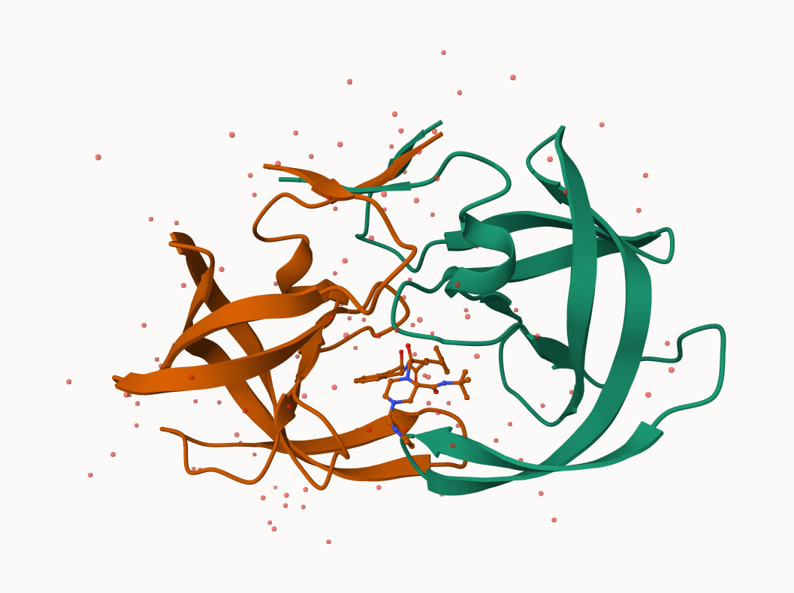
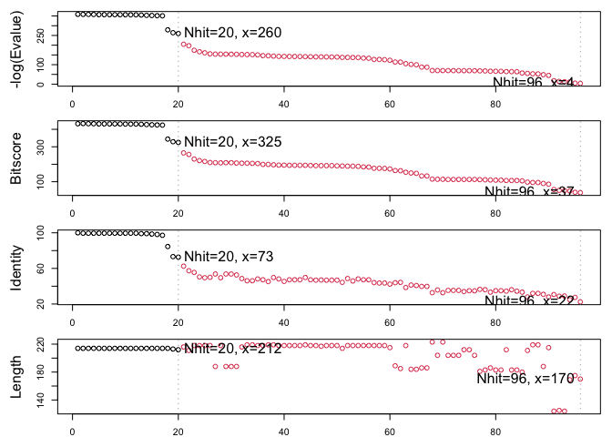
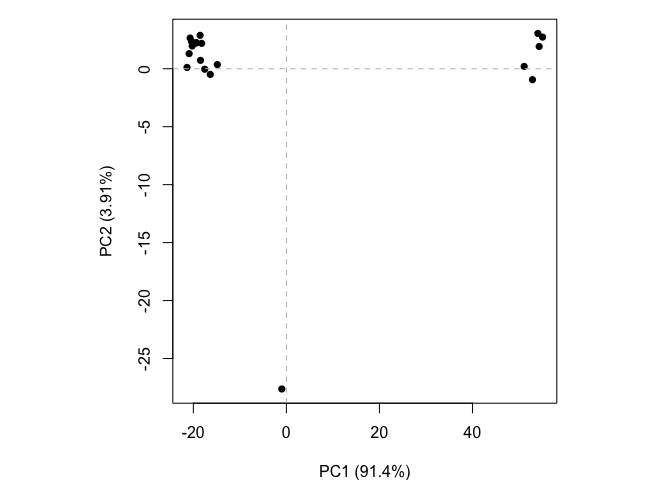

# Class 10: Structural Bioinformatics
Ryan Ellis (PID: A17673864)

- [Intro into the PDB (protien data
  bank)](#intro-into-the-pdb-protien-data-bank)
- [Visualizing PDB data with
  Mole-STAR](#visualizing-pdb-data-with-mole-star)
- [Introduction to Bio3D in R](#introduction-to-bio3d-in-r)
- [Predict the flexibility of a given
  strcuture](#predict-the-flexibility-of-a-given-strcuture)
- [Comparative structure analysis of ADK
  family](#comparative-structure-analysis-of-adk-family)

## Intro into the PDB (protien data bank)

Below is a data set from the protein database which entails how
different molecular (DNA, Protein, oligosaccarides) structures where
solved, namely the techniques involved

``` r
pdb.data<-read.csv("Data Export Summary.csv", row.names=1)
pdb.data
```

                              X.ray     EM    NMR Integrative Multiple.methods
    Protein (only)          180,758 23,111 12,813         348              229
    Protein/Oligosaccharide  10,488  3,741     34           8               11
    Protein/NA                9,205  6,751    287          26                8
    Nucleic acid (only)       3,154    250  1,578           3               15
    Other                       178     27     35           4                0
    Oligosaccharide (only)       11      0      6           0                1
                            Neutron Other   Total
    Protein (only)               84    32 217,375
    Protein/Oligosaccharide       1     0  14,283
    Protein/NA                    0     0  16,277
    Nucleic acid (only)           3     1   5,004
    Other                         0     0     244
    Oligosaccharide (only)        0     4      22

``` r
pdb.data$X.ray
```

    [1] "180,758" "10,488"  "9,205"   "3,154"   "178"     "11"     

This print out above `pdb$X.ray` is “charcater” not “numeric”. Therefore
we cannot do any mathematics on the it. How do we get rid of the commas?

``` r
#Using the `sub()` function we can replace the pattern of commas with a new pattern of just "":
x<-pdb.data$X.ray
tmp<-sub(",", "", x)
sum(as.numeric(tmp))
```

    [1] 203794

We can make this into a function to do this:

``` r
rm.comma<- function(x){
tmp<-sub(",", "", x)
sum(as.numeric(tmp))
  }
```

``` r
rm.comma(pdb.data$Total)
```

    [1] 253205

We can also use a different import function for this CSV that speaks
American (i.e deals with commas in numbers, inside a comma separated
file (CSV)).

``` r
library(readr)

pdb<-read_csv("Data Export Summary.csv")
```

    Rows: 6 Columns: 9
    ── Column specification ────────────────────────────────────────────────────────
    Delimiter: ","
    chr (1): Molecular Type
    dbl (4): Integrative, Multiple methods, Neutron, Other
    num (4): X-ray, EM, NMR, Total

    ℹ Use `spec()` to retrieve the full column specification for this data.
    ℹ Specify the column types or set `show_col_types = FALSE` to quiet this message.

``` r
sum(pdb$`X-ray`)
```

    [1] 203794

> Q1: What percentage of structures in the PDB are solved by X-Ray and
> Electron Microscopy.

``` r
tot.em<- sum(pdb$`EM`)
tot.xray<- sum(pdb$`X-ray`)
n.tot<- sum(pdb$`Total`)

(sum(tot.em,tot.xray)/n.tot)*100
```

    [1] 93.86623

> Q. How many protiens are total in the dataset?

``` r
pdb$Total[1]
```

    [1] 217375

The total number of protein sequences is 202,556,414 (from uni
port\>statistics\>number of entries(total(previewed)))

``` r
217375/202556414*100
```

    [1] 0.1073158

> **Key Point**: Very small coverage in the structuires of known
> protiens (~0.1%). Most structres that are solved and we know about
> (~80%) come form one method (X-ray crystalography)

> Q2: What proportion of structures in the PDB are protein?

``` r
#How to sum a row instead of column??
tot.protien<- sum(pdb$`Protein (only)`)
```

    Warning: Unknown or uninitialised column: `Protein (only)`.

``` r
summary(pdb)
```

     Molecular Type         X-ray              EM                NMR          
     Length:6           Min.   :    11   Min.   :    0.00   Min.   :    6.00  
     Class :character   1st Qu.:   922   1st Qu.:   82.75   1st Qu.:   34.25  
     Mode  :character   Median :  6180   Median : 1995.50   Median :  161.00  
                        Mean   : 33966   Mean   : 5646.67   Mean   : 2458.83  
                        3rd Qu.: 10167   3rd Qu.: 5998.50   3rd Qu.: 1255.25  
                        Max.   :180758   Max.   :23111.00   Max.   :12813.00  
      Integrative     Multiple methods    Neutron          Other       
     Min.   :  0.00   Min.   :  0.00   Min.   : 0.00   Min.   : 0.000  
     1st Qu.:  3.25   1st Qu.:  2.75   1st Qu.: 0.00   1st Qu.: 0.000  
     Median :  6.00   Median :  9.50   Median : 0.50   Median : 0.500  
     Mean   : 64.83   Mean   : 44.00   Mean   :14.67   Mean   : 6.167  
     3rd Qu.: 21.50   3rd Qu.: 14.00   3rd Qu.: 2.50   3rd Qu.: 3.250  
     Max.   :348.00   Max.   :229.00   Max.   :84.00   Max.   :32.000  
         Total       
     Min.   :    22  
     1st Qu.:  1434  
     Median :  9644  
     Mean   : 42201  
     3rd Qu.: 15778  
     Max.   :217375  

> Q.3: *SKIPPED*

## Visualizing PDB data with Mole-STAR

Main standalone web version can be found here
https://molstar.org/viewer/



> Q4: Water molecules normally have 3 atoms. Why do we see just one atom
> per water molecule in this structure?

We are only viewing the oxygen and not the hydrogen, this is because it
is the smallest element, in comparison to oxygen it is magnitudes
smaller. The resolution of the final product is 2 angstrom, and hydrogen
is smaller than the resolution meaning it is invisible.


> Q5: There is a critical “conserved” water molecule in the binding
> site. Can you identify this water molecule? What residue number does
> this water molecule have

This water has a residue number of 308 (HOH), and the oxygen
specifically has an IDX number of 1608

> Q6: Generate and save a figure clearly showing the two distinct chains
> of HIV-protease along with the ligand. You might also consider showing
> the catalytic residues ASP 25 in each chain and the critical water (we
> recommend “Ball & Stick” for these side-chains). Add this figure to
> your Quarto document.


## Introduction to Bio3D in R

We will be using a package within R called `bio3d()` that will allow us
to read and analyze these structures. It is an R package from CRAN for
structural bioinformatics.

``` r
library(bio3d)

pdb<- read.pdb("1hsg")
```

      Note: Accessing on-line PDB file

``` r
pdb
```


     Call:  read.pdb(file = "1hsg")

       Total Models#: 1
         Total Atoms#: 1686,  XYZs#: 5058  Chains#: 2  (values: A B)

         Protein Atoms#: 1514  (residues/Calpha atoms#: 198)
         Nucleic acid Atoms#: 0  (residues/phosphate atoms#: 0)

         Non-protein/nucleic Atoms#: 172  (residues: 128)
         Non-protein/nucleic resid values: [ HOH (127), MK1 (1) ]

       Protein sequence:
          PQITLWQRPLVTIKIGGQLKEALLDTGADDTVLEEMSLPGRWKPKMIGGIGGFIKVRQYD
          QILIEICGHKAIGTVLVGPTPVNIIGRNLLTQIGCTLNFPQITLWQRPLVTIKIGGQLKE
          ALLDTGADDTVLEEMSLPGRWKPKMIGGIGGFIKVRQYDQILIEICGHKAIGTVLVGPTP
          VNIIGRNLLTQIGCTLNF

    + attr: atom, xyz, seqres, helix, sheet,
            calpha, remark, call

``` r
head(pdb$atom)
```

      type eleno elety  alt resid chain resno insert      x      y     z o     b
    1 ATOM     1     N <NA>   PRO     A     1   <NA> 29.361 39.686 5.862 1 38.10
    2 ATOM     2    CA <NA>   PRO     A     1   <NA> 30.307 38.663 5.319 1 40.62
    3 ATOM     3     C <NA>   PRO     A     1   <NA> 29.760 38.071 4.022 1 42.64
    4 ATOM     4     O <NA>   PRO     A     1   <NA> 28.600 38.302 3.676 1 43.40
    5 ATOM     5    CB <NA>   PRO     A     1   <NA> 30.508 37.541 6.342 1 37.87
    6 ATOM     6    CG <NA>   PRO     A     1   <NA> 29.296 37.591 7.162 1 38.40
      segid elesy charge
    1  <NA>     N   <NA>
    2  <NA>     C   <NA>
    3  <NA>     C   <NA>
    4  <NA>     O   <NA>
    5  <NA>     C   <NA>
    6  <NA>     C   <NA>

There are lots of functions that can work with these `pdb` objects

``` r
head(pdbseq(pdb))
```

      1   2   3   4   5   6 
    "P" "Q" "I" "T" "L" "W" 

``` r
nrow(pdb$atom)
```

    [1] 1686

> Q7: How many amino acid residues are there in this pdb object?

1686 Residues

> Q8: Name one of the two non-protein residues?

``` r
pdb
```


     Call:  read.pdb(file = "1hsg")

       Total Models#: 1
         Total Atoms#: 1686,  XYZs#: 5058  Chains#: 2  (values: A B)

         Protein Atoms#: 1514  (residues/Calpha atoms#: 198)
         Nucleic acid Atoms#: 0  (residues/phosphate atoms#: 0)

         Non-protein/nucleic Atoms#: 172  (residues: 128)
         Non-protein/nucleic resid values: [ HOH (127), MK1 (1) ]

       Protein sequence:
          PQITLWQRPLVTIKIGGQLKEALLDTGADDTVLEEMSLPGRWKPKMIGGIGGFIKVRQYD
          QILIEICGHKAIGTVLVGPTPVNIIGRNLLTQIGCTLNFPQITLWQRPLVTIKIGGQLKE
          ALLDTGADDTVLEEMSLPGRWKPKMIGGIGGFIKVRQYDQILIEICGHKAIGTVLVGPTP
          VNIIGRNLLTQIGCTLNF

    + attr: atom, xyz, seqres, helix, sheet,
            calpha, remark, call

One of the two non protien residues is a water molecule (HOH (127))

> Q9: How many protein chains are in this structure?

``` r
table(pdb$atom$chain)
```


      A   B 
    801 885 

There are two proiten chains present A and B.

``` r
# Install packages in the R console NOT your Rmd/Quarto file
```

> Q10. Which of the packages above is found only on BioConductor and not
> CRAN?

MSA is only found in BioCmanager.

> Q11. Which of the above packages is not found on BioConductor or
> CRAN?:

Remotes is found in niether (github)

> Q12. True or False? Functions from the pak package can be used to
> install packages from GitHub and BitBucket?

True. via devtools::install\_

Lets have a quick interactive view of any of these pdb `objects`.

``` r
library(bio3dview)
view.pdb(pdb)
```

Lets try a custom view

``` r
view.pdb(pdb, colorScheme ="sse", 
         backgroundColor = "black" 
         )
```

> Q. create a custom view of the HIV protease highlighting the active
> site ASP(`resno=25`), the two chains (in your choice of colors) and
> the ligand all on a custom coor background?

``` r
library(NGLVieweR)
active.site<- atom.select(pdb, resno=25)
view.pdb(pdb, 
         cols=c("red","blue"),
         highlight =active.site,
         highlight.style = "spacefill",
         backgroundColor = "purple") |> 
  setSpin()
```

## Predict the flexibility of a given strcuture

Lets do a Normal Mode Analysis (NMA) to predict the flexibility of a
given `pdb` object

``` r
adk <- read.pdb("6s36")
```

      Note: Accessing on-line PDB file
       PDB has ALT records, taking A only, rm.alt=TRUE

``` r
adk
```


     Call:  read.pdb(file = "6s36")

       Total Models#: 1
         Total Atoms#: 1898,  XYZs#: 5694  Chains#: 1  (values: A)

         Protein Atoms#: 1654  (residues/Calpha atoms#: 214)
         Nucleic acid Atoms#: 0  (residues/phosphate atoms#: 0)

         Non-protein/nucleic Atoms#: 244  (residues: 244)
         Non-protein/nucleic resid values: [ CL (3), HOH (238), MG (2), NA (1) ]

       Protein sequence:
          MRIILLGAPGAGKGTQAQFIMEKYGIPQISTGDMLRAAVKSGSELGKQAKDIMDAGKLVT
          DELVIALVKERIAQEDCRNGFLLDGFPRTIPQADAMKEAGINVDYVLEFDVPDELIVDKI
          VGRRVHAPSGRVYHVKFNPPKVEGKDDVTGEELTTRKDDQEETVRKRLVEYHQMTAPLIG
          YYSKEAEAGNTKYAKVDGTKPVAEVRADLEKILG

    + attr: atom, xyz, seqres, helix, sheet,
            calpha, remark, call

``` r
m<- nma(adk)
```

     Building Hessian...        Done in 0.011 seconds.
     Diagonalizing Hessian...   Done in 0.265 seconds.

``` r
plot(m)
```


View the results with an interactive file

``` r
view.nma(m)
```

Write out the results for viewing in Mol-star:

``` r
mktrj(m,file="nma.pdb")
```

## Comparative structure analysis of ADK family

Our first step is find a sequence for this family. We will use the
database ID “1ake_A” here:

``` r
library(bio3d)
id<- "1ake_A" ## Just change this ID and you can do this for any sequence!!
aa<- get.seq(id)
```

    Warning in get.seq(id): Removing existing file: seqs.fasta

    Fetching... Please wait. Done.

``` r
aa
```

                 1        .         .         .         .         .         60 
    pdb|1AKE|A   MRIILLGAPGAGKGTQAQFIMEKYGIPQISTGDMLRAAVKSGSELGKQAKDIMDAGKLVT
                 1        .         .         .         .         .         60 

                61        .         .         .         .         .         120 
    pdb|1AKE|A   DELVIALVKERIAQEDCRNGFLLDGFPRTIPQADAMKEAGINVDYVLEFDVPDELIVDRI
                61        .         .         .         .         .         120 

               121        .         .         .         .         .         180 
    pdb|1AKE|A   VGRRVHAPSGRVYHVKFNPPKVEGKDDVTGEELTTRKDDQEETVRKRLVEYHQMTAPLIG
               121        .         .         .         .         .         180 

               181        .         .         .   214 
    pdb|1AKE|A   YYSKEAEAGNTKYAKVDGTKPVAEVRADLEKILG
               181        .         .         .   214 

    Call:
      read.fasta(file = outfile)

    Class:
      fasta

    Alignment dimensions:
      1 sequence rows; 214 position columns (214 non-gap, 0 gap) 

    + attr: id, ali, call

> Q13. How many amino acids are in this sequence, i.e. how long is this
> sequence?

There are 214 AA in this sequence (ADK)

Search for related sequences in the database

``` r
blast<- blast.pdb(aa)
```

     Searching ... please wait (updates every 5 seconds) RID = 1BW6SEK1014 
     .
     Reporting 96 hits

``` r
head(blast$hit.tbl)
```

            queryid subjectids identity alignmentlength mismatches gapopens q.start
    1 Query_2087077     1AKE_A  100.000             214          0        0       1
    2 Query_2087077     8BQF_A   99.533             214          1        0       1
    3 Query_2087077     4X8M_A   99.533             214          1        0       1
    4 Query_2087077     6S36_A   99.533             214          1        0       1
    5 Query_2087077     9R6U_A   99.533             214          1        0       1
    6 Query_2087077     9R71_A   99.533             214          1        0       1
      q.end s.start s.end    evalue bitscore positives mlog.evalue pdb.id    acc
    1   214       1   214 1.82e-156      432    100.00    358.6044 1AKE_A 1AKE_A
    2   214      21   234 2.98e-156      433    100.00    358.1114 8BQF_A 8BQF_A
    3   214       1   214 3.26e-156      432    100.00    358.0215 4X8M_A 4X8M_A
    4   214       1   214 4.78e-156      432    100.00    357.6388 6S36_A 6S36_A
    5   214       1   214 1.07e-155      431     99.53    356.8330 9R6U_A 9R6U_A
    6   214       1   214 1.26e-155      431     99.53    356.6696 9R71_A 9R71_A

``` r
hits<-plot(blast)
```

      * Possible cutoff values:    260 3 
                Yielding Nhits:    20 96 

      * Chosen cutoff value of:    260 
                Yielding Nhits:    20 



``` r
hits$pdb.id
```

     [1] "1AKE_A" "8BQF_A" "4X8M_A" "6S36_A" "9R6U_A" "9R71_A" "8Q2B_A" "8RJ9_A"
     [9] "6RZE_A" "4X8H_A" "3HPR_A" "1E4V_A" "5EJE_A" "1E4Y_A" "3X2S_A" "6HAP_A"
    [17] "6HAM_A" "8PVW_A" "4K46_A" "4NP6_A"

``` r
files <- get.pdb(hits$pdb.id, path="pdbs", split=TRUE, gzip=TRUE)
```


      |                                                                            
      |                                                                      |   0%
      |                                                                            
      |====                                                                  |   5%
      |                                                                            
      |=======                                                               |  10%
      |                                                                            
      |==========                                                            |  15%
      |                                                                            
      |==============                                                        |  20%
      |                                                                            
      |==================                                                    |  25%
      |                                                                            
      |=====================                                                 |  30%
      |                                                                            
      |========================                                              |  35%
      |                                                                            
      |============================                                          |  40%
      |                                                                            
      |================================                                      |  45%
      |                                                                            
      |===================================                                   |  50%
      |                                                                            
      |======================================                                |  55%
      |                                                                            
      |==========================================                            |  60%
      |                                                                            
      |==============================================                        |  65%
      |                                                                            
      |=================================================                     |  70%
      |                                                                            
      |====================================================                  |  75%
      |                                                                            
      |========================================================              |  80%
      |                                                                            
      |============================================================          |  85%
      |                                                                            
      |===============================================================       |  90%
      |                                                                            
      |==================================================================    |  95%
      |                                                                            
      |======================================================================| 100%

Align and supperpose all the ADK structures

``` r
pdbs <- pdbaln(files, fit = TRUE, exefile="msa")
```

    Reading PDB files:
    pdbs/split_chain/1AKE_A.pdb
    pdbs/split_chain/8BQF_A.pdb
    pdbs/split_chain/4X8M_A.pdb
    pdbs/split_chain/6S36_A.pdb
    pdbs/split_chain/9R6U_A.pdb
    pdbs/split_chain/9R71_A.pdb
    pdbs/split_chain/8Q2B_A.pdb
    pdbs/split_chain/8RJ9_A.pdb
    pdbs/split_chain/6RZE_A.pdb
    pdbs/split_chain/4X8H_A.pdb
    pdbs/split_chain/3HPR_A.pdb
    pdbs/split_chain/1E4V_A.pdb
    pdbs/split_chain/5EJE_A.pdb
    pdbs/split_chain/1E4Y_A.pdb
    pdbs/split_chain/3X2S_A.pdb
    pdbs/split_chain/6HAP_A.pdb
    pdbs/split_chain/6HAM_A.pdb
    pdbs/split_chain/8PVW_A.pdb
    pdbs/split_chain/4K46_A.pdb
    pdbs/split_chain/4NP6_A.pdb
       PDB has ALT records, taking A only, rm.alt=TRUE
    .   PDB has ALT records, taking A only, rm.alt=TRUE
    ..   PDB has ALT records, taking A only, rm.alt=TRUE
    .   PDB has ALT records, taking A only, rm.alt=TRUE
    .   PDB has ALT records, taking A only, rm.alt=TRUE
    .   PDB has ALT records, taking A only, rm.alt=TRUE
    .   PDB has ALT records, taking A only, rm.alt=TRUE
    .   PDB has ALT records, taking A only, rm.alt=TRUE
    ..   PDB has ALT records, taking A only, rm.alt=TRUE
    ..   PDB has ALT records, taking A only, rm.alt=TRUE
    ....   PDB has ALT records, taking A only, rm.alt=TRUE
    .   PDB has ALT records, taking A only, rm.alt=TRUE
    .   PDB has ALT records, taking A only, rm.alt=TRUE
    ..

    Extracting sequences

    pdb/seq: 1   name: pdbs/split_chain/1AKE_A.pdb 
       PDB has ALT records, taking A only, rm.alt=TRUE
    pdb/seq: 2   name: pdbs/split_chain/8BQF_A.pdb 
       PDB has ALT records, taking A only, rm.alt=TRUE
    pdb/seq: 3   name: pdbs/split_chain/4X8M_A.pdb 
    pdb/seq: 4   name: pdbs/split_chain/6S36_A.pdb 
       PDB has ALT records, taking A only, rm.alt=TRUE
    pdb/seq: 5   name: pdbs/split_chain/9R6U_A.pdb 
       PDB has ALT records, taking A only, rm.alt=TRUE
    pdb/seq: 6   name: pdbs/split_chain/9R71_A.pdb 
       PDB has ALT records, taking A only, rm.alt=TRUE
    pdb/seq: 7   name: pdbs/split_chain/8Q2B_A.pdb 
       PDB has ALT records, taking A only, rm.alt=TRUE
    pdb/seq: 8   name: pdbs/split_chain/8RJ9_A.pdb 
       PDB has ALT records, taking A only, rm.alt=TRUE
    pdb/seq: 9   name: pdbs/split_chain/6RZE_A.pdb 
       PDB has ALT records, taking A only, rm.alt=TRUE
    pdb/seq: 10   name: pdbs/split_chain/4X8H_A.pdb 
    pdb/seq: 11   name: pdbs/split_chain/3HPR_A.pdb 
       PDB has ALT records, taking A only, rm.alt=TRUE
    pdb/seq: 12   name: pdbs/split_chain/1E4V_A.pdb 
    pdb/seq: 13   name: pdbs/split_chain/5EJE_A.pdb 
       PDB has ALT records, taking A only, rm.alt=TRUE
    pdb/seq: 14   name: pdbs/split_chain/1E4Y_A.pdb 
    pdb/seq: 15   name: pdbs/split_chain/3X2S_A.pdb 
    pdb/seq: 16   name: pdbs/split_chain/6HAP_A.pdb 
    pdb/seq: 17   name: pdbs/split_chain/6HAM_A.pdb 
       PDB has ALT records, taking A only, rm.alt=TRUE
    pdb/seq: 18   name: pdbs/split_chain/8PVW_A.pdb 
       PDB has ALT records, taking A only, rm.alt=TRUE
    pdb/seq: 19   name: pdbs/split_chain/4K46_A.pdb 
       PDB has ALT records, taking A only, rm.alt=TRUE
    pdb/seq: 20   name: pdbs/split_chain/4NP6_A.pdb 

Quick interactive structural view

``` r
view.pdbs(pdbs)
```

PCA of all the structural data (x,y and z atom coordinates)

``` r
pc<- pca(pdbs)
plot(pc)
```


``` r
## Bottom right corner is the loading's plot (how many PC do you need?)
```

``` r
plot(pc,1:2)
```



``` r
## PC1 captures 91.4% of the variance. we have an active and inactive form. one at -20 and one at +40
```

Interactive view of the PC1 captured structural differences:

``` r
view.pca(pc)
```

``` r
mktrj(pc,file="pca.pdb")
```
