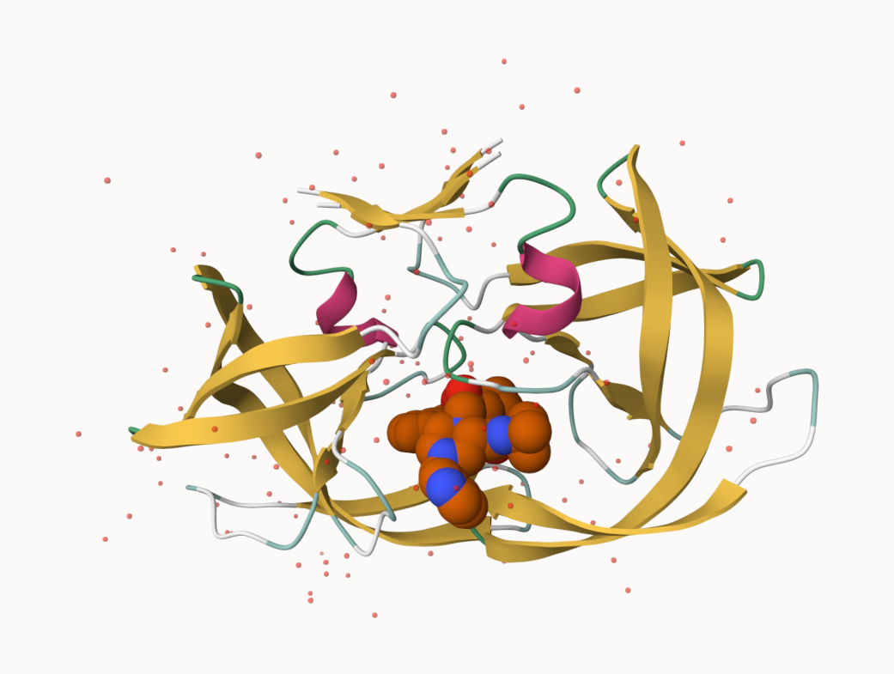
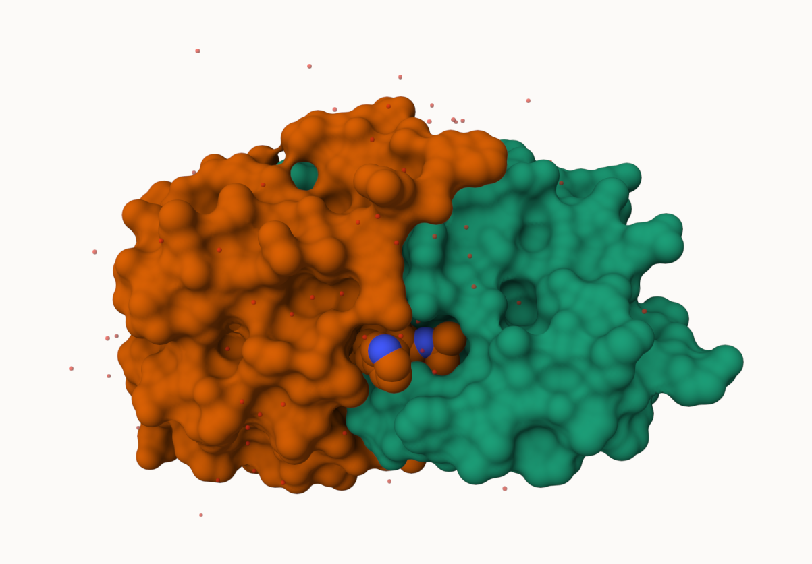
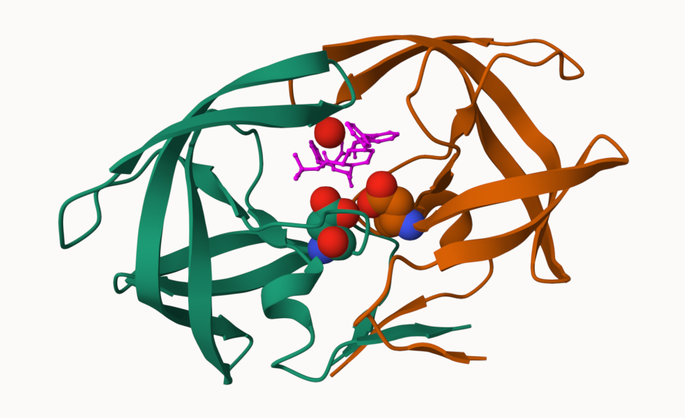

## Intro into the PDB (protien data bank) 

Below is a data set from the protein database which entails how different molecular (DNA, Protein, oligosaccarides) structures where solved, namely the techniques involved 

```{r}
pdb.data<-read.csv("Data Export Summary.csv", row.names=1)
pdb.data
```

```{r}
pdb.data$X.ray
```

This print out above `pdb$X.ray` is "charcater" not "numeric". Therefore we cannot do any mathematics on the it. How do we get rid of the commas? 

```{r}
#Using the `sub()` function we can replace the pattern of commas with a new pattern of just "":
x<-pdb.data$X.ray
tmp<-sub(",", "", x)
sum(as.numeric(tmp))
```

We can make this into a function to do this: 

```{r}
rm.comma<- function(x){
tmp<-sub(",", "", x)
sum(as.numeric(tmp))
  }
```

```{r}
rm.comma(pdb.data$Total)
```

We can also use a different import function for this CSV that speaks American (i.e deals with commas in numbers, inside a comma separated file (CSV)).

```{r}
library(readr)

pdb<-read_csv("Data Export Summary.csv")
```

```{r}
sum(pdb$`X-ray`)
```

> Q1: What percentage of structures in the PDB are solved by X-Ray and Electron Microscopy.

```{r}
tot.em<- sum(pdb$`EM`)
tot.xray<- sum(pdb$`X-ray`)
n.tot<- sum(pdb$`Total`)

(sum(tot.em,tot.xray)/n.tot)*100
```
> Q. How many protiens are total in the dataset? 

```{r}
pdb$Total[1]
```

The total number of protein sequences is 202,556,414 (from uni port>statistics>number of entries(total(previewed)))

```{r}
217375/202556414*100
```

> **Key Point**: Very small coverage in the structuires of known protiens (~0.1%). Most structres that are solved and we know about (~80%) come form one method (X-ray crystalography)

> Q2: What proportion of structures in the PDB are protein?

```{r}
#How to sum a row instead of column??
tot.protien<- sum(pdb$`Protein (only)`)
summary(pdb)
```

> Q.3: *SKIPPED*

## Visualizing PDB data with Mole-STAR

Main standalone web version can be found here https://molstar.org/viewer/


> Q4: Water molecules normally have 3 atoms. Why do we see just one atom per water molecule in this structure?

We are only viewing the oxygen and not the hydrogen, this is because it is the smallest element, in comparison to oxygen it is magnitudes smaller. The resolution of the final product is 2 angstrom, and hydrogen is smaller than the resolution meaning it is invisible.





> Q5: There is a critical “conserved” water molecule in the binding site. Can you identify this water molecule? What residue number does this water molecule have

This water has a residue number of 308 (HOH), and the oxygen specifically has an IDX number of 1608

> Q6: Generate and save a figure clearly showing the two distinct chains of HIV-protease along with the ligand. You might also consider showing the catalytic residues ASP 25 in each chain and the critical water (we recommend “Ball & Stick” for these side-chains). Add this figure to your Quarto document.



## Introduction to Bio3D in R

We will be using a package within R called `bio3d()` that will allow us to read and analyze these structures. It is an R package from CRAN for structural bioinformatics. 

```{r}
library(bio3d)

pdb<- read.pdb("1hsg")
pdb
```

```{r}
head(pdb$atom)
```

There are lots of functions that can work with these `pdb` objects

```{r}
head(pdbseq(pdb))
nrow(pdb$atom)
```

> Q7: How many amino acid residues are there in this pdb object? 

1686 Residues 

> Q8: Name one of the two non-protein residues? 

```{r}
pdb
```

One of the two non protien residues is a water molecule (HOH (127))

> Q9: How many protein chains are in this structure? 

```{r}
table(pdb$atom$chain)
```
There are two proiten chains present A and B. 
```{r}
# Install packages in the R console NOT your Rmd/Quarto file
```

> Q10. Which of the packages above is found only on BioConductor and not CRAN? 

MSA is only found in BioCmanager.

> Q11. Which of the above packages is not found on BioConductor or CRAN?: 

Remotes is found in niether (github)

> Q12. True or False? Functions from the pak package can be used to install packages from GitHub and BitBucket? 

True. via devtools::install_

Lets have a quick interactive view of any of these pdb `objects`. 

```{r}
#| eval: !expr knitr::is_html_output()
library(bio3dview)
view.pdb(pdb)
```

Lets try a custom view 
```{r}
#| eval: !expr knitr::is_html_output()
view.pdb(pdb, colorScheme ="sse", 
         backgroundColor = "black" 
         )
```

> Q. create a custom view of the HIV protease highlighting the active site ASP(`resno=25`), the two chains (in your choice of colors) and the ligand all on a custom coor background?

```{r}
#| eval: !expr knitr::is_html_output()
library(NGLVieweR)
active.site<- atom.select(pdb, resno=25)
view.pdb(pdb, 
         cols=c("red","blue"),
         highlight =active.site,
         highlight.style = "spacefill",
         backgroundColor = "purple") |> 
  setSpin()
```

## Predict the flexibility of a given strcuture

Lets do a Normal Mode Analysis (NMA) to predict the flexibility of a given `pdb` object 

```{r}
adk <- read.pdb("6s36")
adk
```

```{r}
m<- nma(adk)
plot(m)
```

View the results with an interactive file 

```{r}
#| eval: !expr knitr::is_html_output()
view.nma(m)
```

Write out the results for viewing in Mol-star:

```{r}
mktrj(m,file="nma.pdb")
```

## Comparative structure analysis of ADK family

Our first step is find a sequence for this family. We will use the database ID "1ake_A" here:

```{r}
library(bio3d)
id<- "1ake_A" ## Just change this ID and you can do this for any sequence!!
aa<- get.seq(id)
aa
```

> Q13. How many amino acids are in this sequence, i.e. how long is this sequence? 

There are 214 AA in this sequence (ADK)

Search for related sequences in the database

```{r}
blast<- blast.pdb(aa)
```

```{r}
head(blast$hit.tbl)
```

```{r}
hits<-plot(blast)
```

```{r}
hits$pdb.id
```

```{r, warning=FALSE}
files <- get.pdb(hits$pdb.id, path="pdbs", split=TRUE, gzip=TRUE)
```

Align and supperpose all the ADK structures 

```{r}
pdbs <- pdbaln(files, fit = TRUE, exefile="msa")
```

Quick interactive structural view 
```{r}
#| eval: !expr knitr::is_html_output()
view.pdbs(pdbs)
```
PCA of all the structural data (x,y and z atom coordinates)

```{r}
pc<- pca(pdbs)
plot(pc)

## Bottom right corner is the loading's plot (how many PC do you need?)
```
```{r}
plot(pc,1:2)
## PC1 captures 91.4% of the variance. we have an active and inactive form. one at -20 and one at +40
```

Interactive view of the PC1 captured structural differences: 

```{r}
#| eval: !expr knitr::is_html_output()
view.pca(pc)
```

```{r}
mktrj(pc,file="pca.pdb")
```

