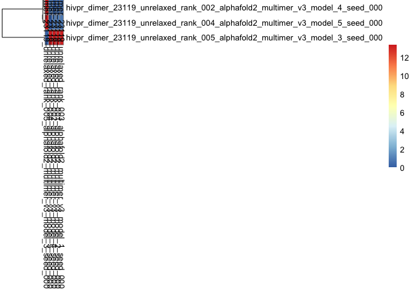
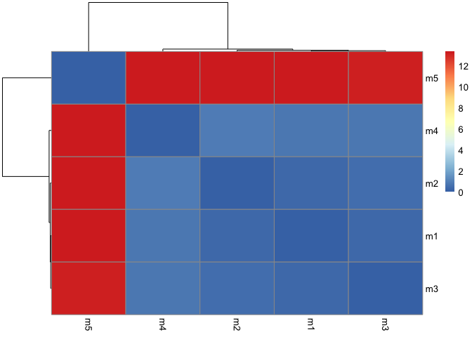
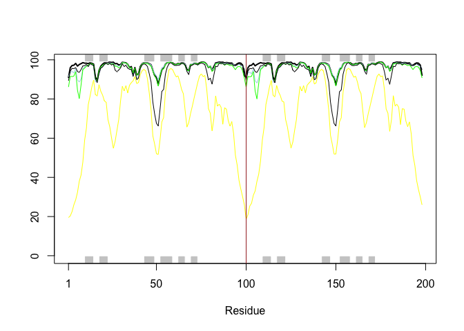
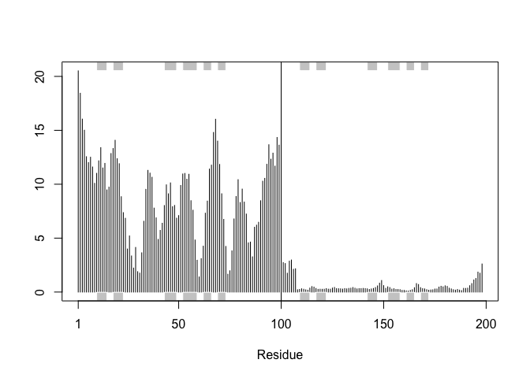
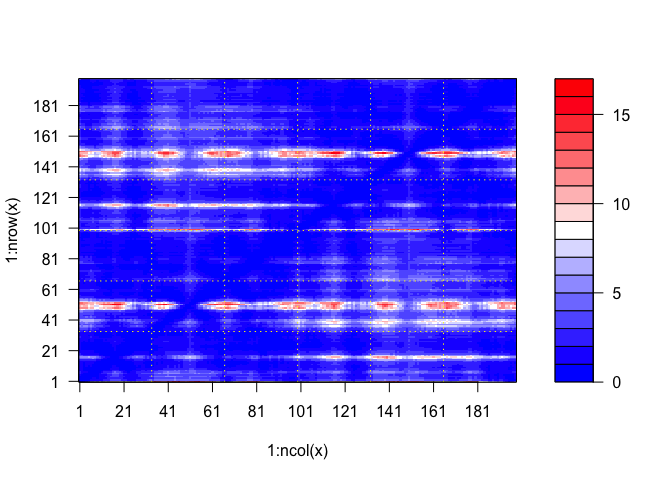
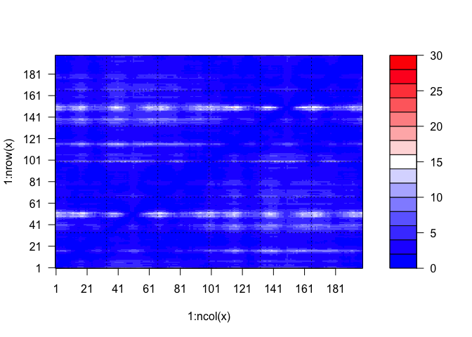
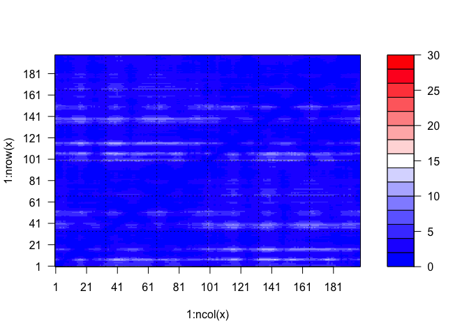
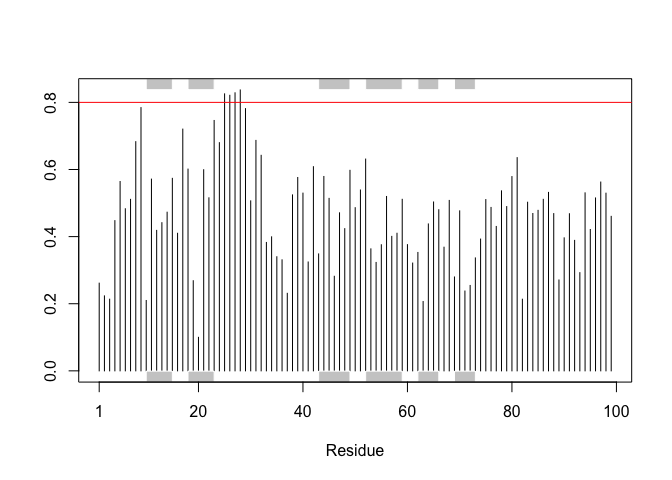

# Class 11: Protein Structure Prediction with AlphaFold
Ryan Ellis (PID: A17673864)

- [Background](#background)
- [Section 8 Custom Analysis](#section-8-custom-analysis)
- [Predicted Alignment Error for
  domains](#predicted-alignment-error-for-domains)
- [Residue conversion](#residue-conversion)
- [Lets view in Mol\*](#lets-view-in-mol)

## Background

Today we will be using R in conjunction with alpha fold to read and
interpret biological data. Alpha fold is an incredibly powerful ai tool
designed for solving biological structures. With the help of R we can
intrepret some of its data.

## Section 8 Custom Analysis

``` r
results_class11<-"hivpr_dimer_23119/"
```

``` r
pdb_files <- list.files(path=results_class11,
                        pattern="*.pdb",
                        full.names=TRUE)

basename(pdb_files)
```

    [1] "hivpr_dimer_23119_unrelaxed_rank_001_alphafold2_multimer_v3_model_2_seed_000.pdb"
    [2] "hivpr_dimer_23119_unrelaxed_rank_002_alphafold2_multimer_v3_model_4_seed_000.pdb"
    [3] "hivpr_dimer_23119_unrelaxed_rank_003_alphafold2_multimer_v3_model_1_seed_000.pdb"
    [4] "hivpr_dimer_23119_unrelaxed_rank_004_alphafold2_multimer_v3_model_5_seed_000.pdb"
    [5] "hivpr_dimer_23119_unrelaxed_rank_005_alphafold2_multimer_v3_model_3_seed_000.pdb"

``` r
library(bio3d)
pdbs <- pdbaln(pdb_files, fit=TRUE, exefile="msa")
```

    Reading PDB files:
    hivpr_dimer_23119//hivpr_dimer_23119_unrelaxed_rank_001_alphafold2_multimer_v3_model_2_seed_000.pdb
    hivpr_dimer_23119//hivpr_dimer_23119_unrelaxed_rank_002_alphafold2_multimer_v3_model_4_seed_000.pdb
    hivpr_dimer_23119//hivpr_dimer_23119_unrelaxed_rank_003_alphafold2_multimer_v3_model_1_seed_000.pdb
    hivpr_dimer_23119//hivpr_dimer_23119_unrelaxed_rank_004_alphafold2_multimer_v3_model_5_seed_000.pdb
    hivpr_dimer_23119//hivpr_dimer_23119_unrelaxed_rank_005_alphafold2_multimer_v3_model_3_seed_000.pdb
    .....

    Extracting sequences

    pdb/seq: 1   name: hivpr_dimer_23119//hivpr_dimer_23119_unrelaxed_rank_001_alphafold2_multimer_v3_model_2_seed_000.pdb 
    pdb/seq: 2   name: hivpr_dimer_23119//hivpr_dimer_23119_unrelaxed_rank_002_alphafold2_multimer_v3_model_4_seed_000.pdb 
    pdb/seq: 3   name: hivpr_dimer_23119//hivpr_dimer_23119_unrelaxed_rank_003_alphafold2_multimer_v3_model_1_seed_000.pdb 
    pdb/seq: 4   name: hivpr_dimer_23119//hivpr_dimer_23119_unrelaxed_rank_004_alphafold2_multimer_v3_model_5_seed_000.pdb 
    pdb/seq: 5   name: hivpr_dimer_23119//hivpr_dimer_23119_unrelaxed_rank_005_alphafold2_multimer_v3_model_3_seed_000.pdb 

``` r
rd<- rmsd(pdbs, fit=TRUE)
```

    Warning in rmsd(pdbs, fit = TRUE): No indices provided, using the 198 non NA positions

``` r
range(rd)
```

    [1]  0.000 13.383

``` r
library(pheatmap)
pheatmap(rd)
```



``` r
colnames(rd)<- paste0("m",1:5)
rownames(rd)<- paste0("m",1:5)
pheatmap(rd)
```



This heat map shows similarities amoungst models. For example the more
red two boxes are the more similar they are to one another. and the same
with blue, the more polarizing the color difference the greater the
differnece in the models.

> Plotting the plDDT values across the varying mdoels

``` r
#1hsg is our starting HIV protease 
pdb<- read.pdb("1hsg")
```

      Note: Accessing on-line PDB file

``` r
plotb3(pdbs$b[1,], typ="l", lwd=2, sse=pdb)
points(pdbs$b[2,], typ="l", col="lightblue")
points(pdbs$b[3,], typ="l", col="green")
points(pdbs$b[4,], typ="l", col="black")
points(pdbs$b[5,], typ="l", col="yellow")
abline(v=100, col="brown")
```



``` r
core<- core.find(pdbs)
```

     core size 197 of 198  vol = 77.215 
     core size 196 of 198  vol = 71.854 
     core size 195 of 198  vol = 67.547 
     core size 194 of 198  vol = 63.715 
     core size 193 of 198  vol = 61.866 
     core size 192 of 198  vol = 60.313 
     core size 191 of 198  vol = 58.789 
     core size 190 of 198  vol = 57.394 
     core size 189 of 198  vol = 55.69 
     core size 188 of 198  vol = 54.019 
     core size 187 of 198  vol = 52.575 
     core size 186 of 198  vol = 50.977 
     core size 185 of 198  vol = 49.694 
     core size 184 of 198  vol = 48.418 
     core size 183 of 198  vol = 47.271 
     core size 182 of 198  vol = 46.24 
     core size 181 of 198  vol = 45.404 
     core size 180 of 198  vol = 44.644 
     core size 179 of 198  vol = 43.7 
     core size 178 of 198  vol = 42.927 
     core size 177 of 198  vol = 42.255 
     core size 176 of 198  vol = 41.724 
     core size 175 of 198  vol = 41.457 
     core size 174 of 198  vol = 41.391 
     core size 173 of 198  vol = 41.238 
     core size 172 of 198  vol = 41.584 
     core size 171 of 198  vol = 41.646 
     core size 170 of 198  vol = 41.484 
     core size 169 of 198  vol = 41.178 
     core size 168 of 198  vol = 41.079 
     core size 167 of 198  vol = 41.098 
     core size 166 of 198  vol = 41.041 
     core size 165 of 198  vol = 40.864 
     core size 164 of 198  vol = 40.404 
     core size 163 of 198  vol = 39.786 
     core size 162 of 198  vol = 38.994 
     core size 161 of 198  vol = 38.39 
     core size 160 of 198  vol = 37.564 
     core size 159 of 198  vol = 37.047 
     core size 158 of 198  vol = 36.336 
     core size 157 of 198  vol = 35.74 
     core size 156 of 198  vol = 35.192 
     core size 155 of 198  vol = 34.348 
     core size 154 of 198  vol = 33.981 
     core size 153 of 198  vol = 33.487 
     core size 152 of 198  vol = 33.007 
     core size 151 of 198  vol = 31.8 
     core size 150 of 198  vol = 31.637 
     core size 149 of 198  vol = 31.041 
     core size 148 of 198  vol = 30.793 
     core size 147 of 198  vol = 30.105 
     core size 146 of 198  vol = 29.603 
     core size 145 of 198  vol = 29.215 
     core size 144 of 198  vol = 28.655 
     core size 143 of 198  vol = 28.061 
     core size 142 of 198  vol = 27.449 
     core size 141 of 198  vol = 26.852 
     core size 140 of 198  vol = 26.316 
     core size 139 of 198  vol = 25.023 
     core size 138 of 198  vol = 24.36 
     core size 137 of 198  vol = 23.612 
     core size 136 of 198  vol = 22.798 
     core size 135 of 198  vol = 22.014 
     core size 134 of 198  vol = 20.703 
     core size 133 of 198  vol = 19.835 
     core size 132 of 198  vol = 18.908 
     core size 131 of 198  vol = 18.34 
     core size 130 of 198  vol = 17.941 
     core size 129 of 198  vol = 17.187 
     core size 128 of 198  vol = 16.331 
     core size 127 of 198  vol = 15.498 
     core size 126 of 198  vol = 14.937 
     core size 125 of 198  vol = 14.248 
     core size 124 of 198  vol = 13.274 
     core size 123 of 198  vol = 12.489 
     core size 122 of 198  vol = 11.585 
     core size 121 of 198  vol = 10.702 
     core size 120 of 198  vol = 10.161 
     core size 119 of 198  vol = 9.526 
     core size 118 of 198  vol = 8.878 
     core size 117 of 198  vol = 8.212 
     core size 116 of 198  vol = 7.63 
     core size 115 of 198  vol = 7.35 
     core size 114 of 198  vol = 7.017 
     core size 113 of 198  vol = 6.691 
     core size 112 of 198  vol = 6.392 
     core size 111 of 198  vol = 5.952 
     core size 110 of 198  vol = 5.709 
     core size 109 of 198  vol = 5.5 
     core size 108 of 198  vol = 5.275 
     core size 107 of 198  vol = 4.928 
     core size 106 of 198  vol = 4.78 
     core size 105 of 198  vol = 4.561 
     core size 104 of 198  vol = 4.2 
     core size 103 of 198  vol = 3.89 
     core size 102 of 198  vol = 3.722 
     core size 101 of 198  vol = 3.642 
     core size 100 of 198  vol = 3.59 
     core size 99 of 198  vol = 3.287 
     core size 98 of 198  vol = 3.029 
     core size 97 of 198  vol = 2.776 
     core size 96 of 198  vol = 2.491 
     core size 95 of 198  vol = 2.076 
     core size 94 of 198  vol = 1.794 
     core size 93 of 198  vol = 1.692 
     core size 92 of 198  vol = 1.434 
     core size 91 of 198  vol = 1.246 
     core size 90 of 198  vol = 1.183 
     core size 89 of 198  vol = 0.958 
     core size 88 of 198  vol = 0.895 
     core size 87 of 198  vol = 0.843 
     core size 86 of 198  vol = 0.804 
     core size 85 of 198  vol = 0.702 
     core size 84 of 198  vol = 0.397 
     FINISHED: Min vol ( 0.5 ) reached

``` r
core.inds<- print(core, vol=0.5)
```

    # 85 positions (cumulative volume <= 0.5 Angstrom^3) 
      start end length
    1     9  46     38
    2    52  52      1
    3    54  78     25
    4    80  97     18

``` r
xyz <- pdbfit(pdbs, core.inds, outpath="corefit_structures")
```

Next using our new variable `xyz` we can examine the RMSF between the
poisiton which was found using core and strcutre which is found in pdb.

``` r
rf<- rmsf(xyz)
plotb3(rf,sse=pdb)

abline(v=100, col="black", ylab="rmsf")
```



It appears that the first chain is highly variable as the RMSF value
flucuates quite alont, and the second chain whihc is past the abline is
not very variable.

## Predicted Alignment Error for domains

Alpha fold produces a PAE in `JSON` format.

``` r
library(jsonlite)

pae_files<- list.files(path=results_class11,
                       pattern=".*model.*\\.json", 
                       full.names=TRUE)
```

``` r
pae2<- read_json(pae_files[2],simplifyVector = TRUE)
pae4<- read_json(pae_files[4],simplifyVector = TRUE)

attributes(pae4)
```

    $names
    [1] "plddt"   "max_pae" "pae"     "ptm"     "iptm"   

``` r
head(pae4$ptm)
```

    [1] 0.9

``` r
pae4$max_pae
```

    [1] 16.9375

max_pae shows how powerful a model is. Having a higher score indiactes a
worse model.

``` r
pae4$max_pae>pae2$max_pae
```

    [1] TRUE

This shows that model 4 is likely a worse model than 2

Here we are using a function within Bio3d, we could use ggplot to show
residue position and PAE score.

> Here is model 4 with its residue numbers and PAE score colored.

``` r
plot.dmat(pae4$pae)
```



``` r
plot.dmat(pae4$pae, 
          grid.col="black",
          zlim=c(0,30))
```



Z range changes the coloring thresholds as seen in the legend to the
right.

``` r
plot.dmat(pae2$pae, 
          grid.col="black",
          zlim=c(0,30))
```



## Residue conversion

``` r
aln_file<- list.files(path=results_class11,
                      pattern=".a3m$",
                      full.names=TRUE)
```

``` r
align<- read.fasta(aln_file[1], to.upper=TRUE)
```

    [1] " ** Duplicated sequence id's: 101 **"
    [2] " ** Duplicated sequence id's: 101 **"

``` r
dim(align$ali)
```

    [1] 5397  132

``` r
?abline()
```

This shows the number of sequences within our original file that are in
alignment.

``` r
sim<- conserv(align)

plotb3(sim[1:99], sse=trim.pdb(pdb, chain="A"), ylabel="conservation score")
```

    Warning in plot.window(xlim, ylim, ...): "ylabel" is not a graphical parameter

    Warning in plot.xy(xy.coords(x, y), type = type, ...): "ylabel" is not a
    graphical parameter

    Warning in title(main = main, sub = sub, xlab = xlab, ylab = ylab, ...):
    "ylabel" is not a graphical parameter

``` r
abline(h=0.80, col="red")
```



I have added a `abline()` to show the bases I am refering to. Buth the
25-28 are all above this `abline()` indicating a highly conserved region
and not just a single residue.

``` r
con <- consensus(align, cutoff = 0.9)
con$seq
```

      [1] "-" "-" "-" "-" "-" "-" "-" "-" "-" "-" "-" "-" "-" "-" "-" "-" "-" "-"
     [19] "-" "-" "-" "-" "-" "-" "D" "T" "G" "A" "-" "-" "-" "-" "-" "-" "-" "-"
     [37] "-" "-" "-" "-" "-" "-" "-" "-" "-" "-" "-" "-" "-" "-" "-" "-" "-" "-"
     [55] "-" "-" "-" "-" "-" "-" "-" "-" "-" "-" "-" "-" "-" "-" "-" "-" "-" "-"
     [73] "-" "-" "-" "-" "-" "-" "-" "-" "-" "-" "-" "-" "-" "-" "-" "-" "-" "-"
     [91] "-" "-" "-" "-" "-" "-" "-" "-" "-" "-" "-" "-" "-" "-" "-" "-" "-" "-"
    [109] "-" "-" "-" "-" "-" "-" "-" "-" "-" "-" "-" "-" "-" "-" "-" "-" "-" "-"
    [127] "-" "-" "-" "-" "-" "-"

## Lets view in Mol\*

``` r
m1.pdb <- read.pdb(pdb_files[1])
occ <- vec2resno(c(sim[1:99], sim[1:99]), m1.pdb$atom$resno)
write.pdb(m1.pdb, o=occ, file="m1_conserv.pdb")
```
