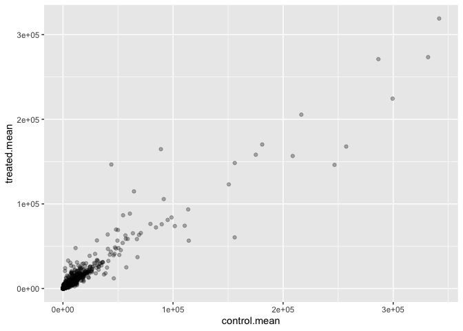
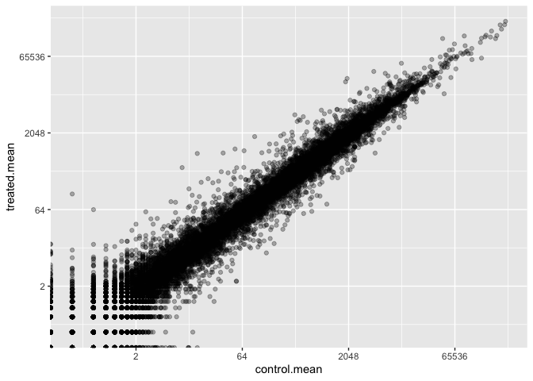
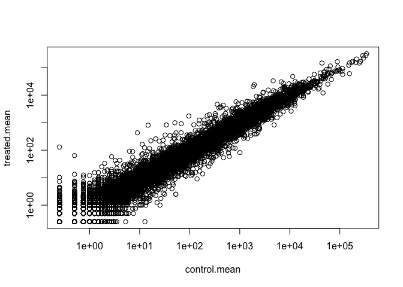
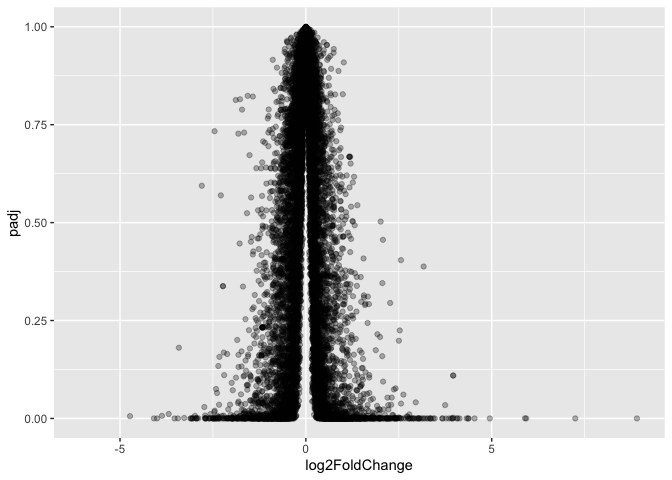
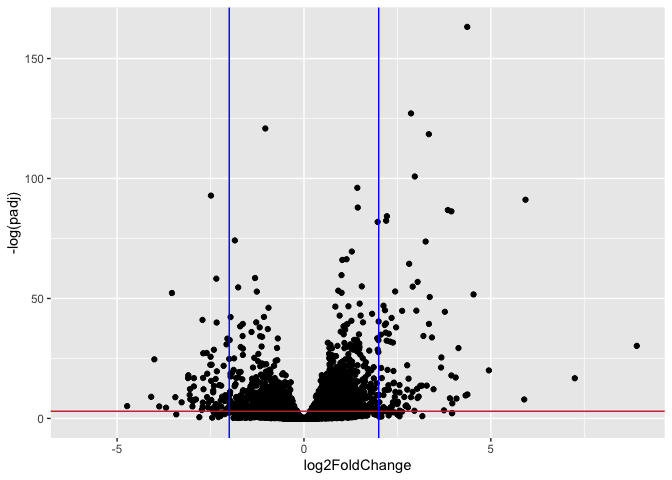
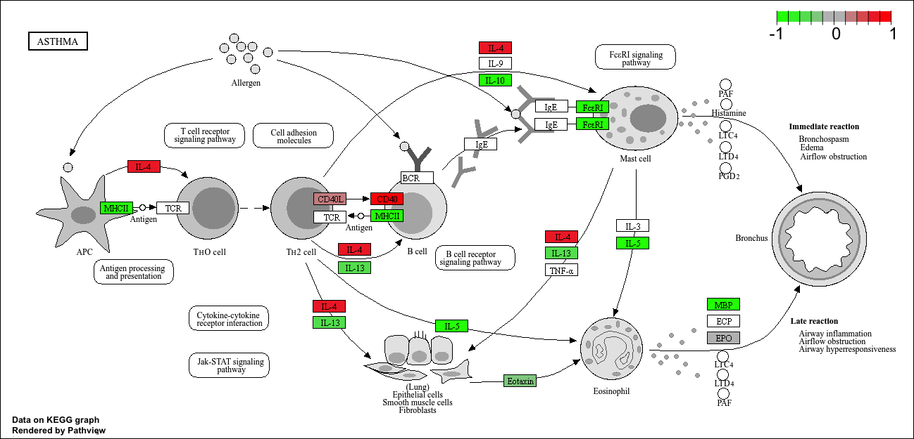

# Class 13: Transcriptomics and the analysis of RNA-Seq data
Ryan Ellis (A17673864)

- [Background](#background)
- [Data Import](#data-import)
- [Toying with Differential Gene
  Expression](#toying-with-differential-gene-expression)
- [Now for Treated!](#now-for-treated)
- [Plot Control Versus treated](#plot-control-versus-treated)
- [Now lets use DESeq Analysis](#now-lets-use-deseq-analysis)
- [Volcano Plot](#volcano-plot)
- [Save our results to date](#save-our-results-to-date)
- [Adding annotation data](#adding-annotation-data)
- [Pathway Analysis](#pathway-analysis)
- [Gene Ontology (GO)](#gene-ontology-go)
- [Save our annotated results](#save-our-annotated-results)

## Background

Today we will do an RNA seq analysis on a datset of a common
cortiocosteroid (dexamethasone/dex) and we will use DESeq for this
analysis.

## Data Import

Now we will read the `count` and `metadata` about this experiment setup
from the given csv files.

``` r
counts<- read.csv("airway_scaledcounts.csv", row.names=1)
metadata<- read.csv("airway_metadata.csv")
```

Having a look:

``` r
head(counts)
```

                    SRR1039508 SRR1039509 SRR1039512 SRR1039513 SRR1039516
    ENSG00000000003        723        486        904        445       1170
    ENSG00000000005          0          0          0          0          0
    ENSG00000000419        467        523        616        371        582
    ENSG00000000457        347        258        364        237        318
    ENSG00000000460         96         81         73         66        118
    ENSG00000000938          0          0          1          0          2
                    SRR1039517 SRR1039520 SRR1039521
    ENSG00000000003       1097        806        604
    ENSG00000000005          0          0          0
    ENSG00000000419        781        417        509
    ENSG00000000457        447        330        324
    ENSG00000000460         94        102         74
    ENSG00000000938          0          0          0

The meta data tells us what is actually inside the columns of our
`counts` data set.

``` r
head(metadata)
```

              id     dex celltype     geo_id
    1 SRR1039508 control   N61311 GSM1275862
    2 SRR1039509 treated   N61311 GSM1275863
    3 SRR1039512 control  N052611 GSM1275866
    4 SRR1039513 treated  N052611 GSM1275867
    5 SRR1039516 control  N080611 GSM1275870
    6 SRR1039517 treated  N080611 GSM1275871

> Q1. How many genes are in this dataset?

There are 38694 genes in this data set

``` r
nrow(counts)
```

    [1] 38694

There are 38694 total genes inside this data set.

> Q2. How many ‘control’ cell lines do we have?

``` r
sum(metadata$dex=="control")
```

    [1] 4

There are 4 control cell lines.

``` r
table(metadata$dex)
```


    control treated 
          4       4 

There are 4 controls.

## Toying with Differential Gene Expression

``` r
ncol(counts)
```

    [1] 8

``` r
colnames(counts)== metadata$id
```

    [1] TRUE TRUE TRUE TRUE TRUE TRUE TRUE TRUE

- Find the “control” columns in our `counts` objects
- Extract just the control column values for all genes
- Calculate the average value per gene in these control values.

``` r
control.inds<- metadata$dex== "control"
control.counts<-counts[,control.inds]
control.mean<-rowMeans(control.counts)
```

``` r
#head(control.mean)
#control <- metadata[metadata[,"dex"]=="control",]
#control.counts <- counts[ ,control$id]
#control.mean <- rowSums( control.counts )/4 
```

> Q3. How would you make the above code in either approach more robust?
> Is there a function that could help here?

I have used the more robust method, by substituting the rowSums method
for a rowMeans method the code can now apply more robustly and will
scale with a changing sample number. Before we used 4 as the sample, now
if we switch to more sample we will not have to change the code.

## Now for Treated!

> Q4. Follow the same procedure for the treated samples (i.e. calculate
> the mean per gene across drug treated samples and assign to a labeled
> vector called treated.mean)

``` r
treated.inds<-metadata$dex =="treated"
treated.counts<- counts[,treated.inds]
treated.mean<- rowMeans(treated.counts)
```

``` r
head(treated.mean)
```

    ENSG00000000003 ENSG00000000005 ENSG00000000419 ENSG00000000457 ENSG00000000460 
             658.00            0.00          546.00          316.50           78.75 
    ENSG00000000938 
               0.00 

## Plot Control Versus treated

For bookkeeping lets store these together as a new object called
`meancounts`

``` r
meancounts<- cbind(control.mean, treated.mean)
head(meancounts)
```

                    control.mean treated.mean
    ENSG00000000003       900.75       658.00
    ENSG00000000005         0.00         0.00
    ENSG00000000419       520.50       546.00
    ENSG00000000457       339.75       316.50
    ENSG00000000460        97.25        78.75
    ENSG00000000938         0.75         0.00

> Q5 (a). Create a scatter plot showing the mean of the treated samples
> against the mean of the control samples.

``` r
plot(meancounts)
```


> Q5 (b).You could also use the ggplot2 package to make this figure
> producing the plot below. What geom\_?() function would you use for
> this plot?

Here we are using a geom_point(alpha) setting to get less overlap
between the values. As a good portion of our data is clustered in the
bottom corner of the plot. but we would need a geom_point function as we
are attempting to make a scatter plot.

``` r
pp<-data.frame(control.mean, treated.mean)

library(ggplot2)
ggplot(pp)+aes(control.mean, treated.mean)+
  geom_point(alpha=0.3)
```



> Q6. Try plotting both axes on a log scale. What is the argument to
> plot() that allows you to do this?

We add into the ggplot a `scale_x_contonous and scale_y_continous`
allowing us to use a log2 transformation and plot on a log scale. *THIS
IS FOR GGPLOT*

``` r
pp<-data.frame(control.mean, treated.mean)

library(ggplot2)
ggplot(pp)+aes(control.mean, treated.mean)+
  geom_point(alpha=0.3)+
scale_x_continuous(trans="log2")+
  scale_y_continuous(trans="log2")
```

    Warning in scale_x_continuous(trans = "log2"): log-2 transformation introduced
    infinite values.

    Warning in scale_y_continuous(trans = "log2"): log-2 transformation introduced
    infinite values.



Count data is highly skewed, we can apply a log scale transformation to
help with this skew.

``` r
plot(meancounts, log="xy")
```

    Warning in xy.coords(x, y, xlabel, ylabel, log): 15032 x values <= 0 omitted
    from logarithmic plot

    Warning in xy.coords(x, y, xlabel, ylabel, log): 15281 y values <= 0 omitted
    from logarithmic plot



We most often use log2 for this kind of data in bioinformatics because
it makes the interpretation much easier.

``` r
#Treated/Control

log2(20/20) # No change 
```

    [1] 0

``` r
log2(40/20) # 1 = Double the change
```

    [1] 1

``` r
log2(20/40) # -1 = Halved 
```

    [1] -1

``` r
log2(80/20) # 2= quadruple
```

    [1] 2

This fraction is called a “log2 fold change” as it will tell us how much
a gene expression increased or decreased in the units of doubling. 1
would be a doubling increase, -1 doubling decrease.

Calculate the log2 fold change for our `treated.mean` and `control.mean`
counts and all this `log2fc`.

``` r
pp$log2fc<-log2(pp$treated.mean/pp$control.mean)

head(pp)
```

                    control.mean treated.mean      log2fc
    ENSG00000000003       900.75       658.00 -0.45303916
    ENSG00000000005         0.00         0.00         NaN
    ENSG00000000419       520.50       546.00  0.06900279
    ENSG00000000457       339.75       316.50 -0.10226805
    ENSG00000000460        97.25        78.75 -0.30441833
    ENSG00000000938         0.75         0.00        -Inf

``` r
zero.vals <- which(pp[,1:2]==0, arr.ind=TRUE)

to.rm <- unique(zero.vals[,1])
mycounts <- pp[-to.rm,]
head(mycounts)
```

                    control.mean treated.mean      log2fc
    ENSG00000000003       900.75       658.00 -0.45303916
    ENSG00000000419       520.50       546.00  0.06900279
    ENSG00000000457       339.75       316.50 -0.10226805
    ENSG00000000460        97.25        78.75 -0.30441833
    ENSG00000000971      5219.00      6687.50  0.35769358
    ENSG00000001036      2327.00      1785.75 -0.38194109

``` r
?which()
```

> Q7. What is the purpose of the arr.ind argument in the which()
> function call above? Why would we then take the first column of the
> output and need to call the unique() function?

The `arr.ind` function allows us to determine which values in a data
frame should be omitted, thus allowing us to remove them from our data
frame and cleanup the data. It returns row and column identifiers to be
used further. Basically will creat a logical vector telling us which
points in a dataframe are zero. We then use the `unique()` function
which makes sure all values inside the DF are unqiue, and will allow us
to remove it if two values in the same sample are zero further cleaning
the data.

> Q8. Using the up.ind vector above can you determine how many up
> regulated genes we have at the greater than 2 fc level?

``` r
up.ind <- mycounts$log2fc > 2
sum(up.ind)
```

    [1] 250

There are 250 regulated genes with a fold change greater than 2.

A common “rule of thumb” threshold for calling a gene “up regulated” or
“down regulated” is a log 2 fold-change value of +2 or -2 (or greater)

## Now lets use DESeq Analysis

Lets do this analysis properly, and not forget about the significance of
the differences.

For this we will use the **DESeq2** package.

``` r
library(DESeq2)
```

To run a DESseq analysis we need at least two inputs:

- `countData` i.e gene counts across different experiments
- `colData` i.e our metadata about those count columns

``` r
dds<- DESeqDataSetFromMatrix(countData =counts, 
                             colData =metadata,
                             design= ~dex)
```

    converting counts to integer mode

Now we can run the DESeq analysis pipeline using the `dds` object that
as all the inputs we need.:

``` r
dds<-DESeq(dds)
```

    estimating size factors

    estimating dispersions

    gene-wise dispersion estimates

    mean-dispersion relationship

    final dispersion estimates

    fitting model and testing

``` r
res<- results(dds)
head(res)
```

    log2 fold change (MLE): dex treated vs control 
    Wald test p-value: dex treated vs control 
    DataFrame with 6 rows and 6 columns
                      baseMean log2FoldChange     lfcSE      stat    pvalue
                     <numeric>      <numeric> <numeric> <numeric> <numeric>
    ENSG00000000003 747.194195      -0.350703  0.168242 -2.084514 0.0371134
    ENSG00000000005   0.000000             NA        NA        NA        NA
    ENSG00000000419 520.134160       0.206107  0.101042  2.039828 0.0413675
    ENSG00000000457 322.664844       0.024527  0.145134  0.168996 0.8658000
    ENSG00000000460  87.682625      -0.147143  0.256995 -0.572550 0.5669497
    ENSG00000000938   0.319167      -1.732289  3.493601 -0.495846 0.6200029
                         padj
                    <numeric>
    ENSG00000000003  0.163017
    ENSG00000000005        NA
    ENSG00000000419  0.175937
    ENSG00000000457  0.961682
    ENSG00000000460  0.815805
    ENSG00000000938        NA

## Volcano Plot

This type of plot puts the log2 fold change and the adjusted p-value
against one another into one plot which can be used to gather insight
for what is occuring inside the datset.

``` r
ggplot(res)+
  aes(log2FoldChange,padj)+
  geom_point(alpha=0.3)
```



Plot not super useful because we don’t want to look at things with
p-value \>0.05 because they are not significant.

``` r
ggplot(res)+
  aes(log2FoldChange,log(padj))+
  geom_point(alpha=0.3)
```


Now lets flip the y-axis so that the “volcano” is right side up

``` r
ggplot(res)+
  aes(log2FoldChange,-log(padj))+
  geom_point()+
  geom_abline(,intercept = -log(0.05), slope=0, color="red")+
geom_vline(,xintercept =2, slope=0, color="blue")+
  geom_vline(,xintercept =-2, slope=0, color="blue")
```



Important ones= the “lava” spewing out the top -\> low p-value high fold
change.

## Save our results to date

``` r
write.csv(res,file="myresults.csv")
```

## Adding annotation data

We need to “map” our ensemble data gene identifiers in our results
object to date to the identifiers used in different databases we want to
use for learning more about these genes.

For this we will use a couple of BioConductor packages. We can install
these using: `BiocManager::install("org.Hs.eg.db")` and
`BiocManager::install("AnnotationDbi")` in the console.

``` r
library("AnnotationDbi")
library("org.Hs.eg.db")
```

We can see the columns in `org.Hs.eg.db` that list the different
databases we can map between.

``` r
columns(org.Hs.eg.db)
```

     [1] "ACCNUM"       "ALIAS"        "ENSEMBL"      "ENSEMBLPROT"  "ENSEMBLTRANS"
     [6] "ENTREZID"     "ENZYME"       "EVIDENCE"     "EVIDENCEALL"  "GENENAME"    
    [11] "GENETYPE"     "GO"           "GOALL"        "IPI"          "MAP"         
    [16] "OMIM"         "ONTOLOGY"     "ONTOLOGYALL"  "PATH"         "PFAM"        
    [21] "PMID"         "PROSITE"      "REFSEQ"       "SYMBOL"       "UCSCKG"      
    [26] "UNIPROT"     

We can now use the `mapIDs()` function to map between these different
database Identifier formats.

``` r
res$symbol<-mapIds(org.Hs.eg.db,
      keys=row.names(res),
       keytype="ENSEMBL", 
      column="SYMBOL")
```

    'select()' returned 1:many mapping between keys and columns

> Q. Can you add “GENENAME: and add a new”coloumn” to our `res` object

``` r
res$genename<-mapIds(org.Hs.eg.db,
      keys=row.names(res),
       keytype="ENSEMBL", 
      column="GENENAME")
```

    'select()' returned 1:many mapping between keys and columns

> Q. Add “ENTREZID” as `res$entrez`

``` r
res$entrez<-mapIds(org.Hs.eg.db,
      keys=row.names(res),
       keytype="ENSEMBL", 
      column="ENTREZID")
```

    'select()' returned 1:many mapping between keys and columns

``` r
head(res)
```

    log2 fold change (MLE): dex treated vs control 
    Wald test p-value: dex treated vs control 
    DataFrame with 6 rows and 9 columns
                      baseMean log2FoldChange     lfcSE      stat    pvalue
                     <numeric>      <numeric> <numeric> <numeric> <numeric>
    ENSG00000000003 747.194195      -0.350703  0.168242 -2.084514 0.0371134
    ENSG00000000005   0.000000             NA        NA        NA        NA
    ENSG00000000419 520.134160       0.206107  0.101042  2.039828 0.0413675
    ENSG00000000457 322.664844       0.024527  0.145134  0.168996 0.8658000
    ENSG00000000460  87.682625      -0.147143  0.256995 -0.572550 0.5669497
    ENSG00000000938   0.319167      -1.732289  3.493601 -0.495846 0.6200029
                         padj      symbol               genename      entrez
                    <numeric> <character>            <character> <character>
    ENSG00000000003  0.163017      TSPAN6          tetraspanin 6        7105
    ENSG00000000005        NA        TNMD            tenomodulin       64102
    ENSG00000000419  0.175937        DPM1 dolichyl-phosphate m..        8813
    ENSG00000000457  0.961682       SCYL3 SCY1 like pseudokina..       57147
    ENSG00000000460  0.815805       FIRRM FIGNL1 interacting r..       55732
    ENSG00000000938        NA         FGR FGR proto-oncogene, ..        2268

## Pathway Analysis

Now we have the annotated results with their log2 fold change and
p-values we can figure out which biological pathways and process these
genes are involved with.

We will use the **gage** and **pathview** packages for this step and we
can install them with:
`BiocManager::install( c("pathview", "gage", "gageData") )`

``` r
library(gage)
library(pathview)
library(gageData)
```

Lets have a look at the gageData

``` r
data(kegg.sets.hs)
# Examine the first 2 pathways in this kegg set for humans
head(kegg.sets.hs, 2)
```

    $`hsa00232 Caffeine metabolism`
    [1] "10"   "1544" "1548" "1549" "1553" "7498" "9"   

    $`hsa00983 Drug metabolism - other enzymes`
     [1] "10"     "1066"   "10720"  "10941"  "151531" "1548"   "1549"   "1551"  
     [9] "1553"   "1576"   "1577"   "1806"   "1807"   "1890"   "221223" "2990"  
    [17] "3251"   "3614"   "3615"   "3704"   "51733"  "54490"  "54575"  "54576" 
    [25] "54577"  "54578"  "54579"  "54600"  "54657"  "54658"  "54659"  "54963" 
    [33] "574537" "64816"  "7083"   "7084"   "7172"   "7363"   "7364"   "7365"  
    [41] "7366"   "7367"   "7371"   "7372"   "7378"   "7498"   "79799"  "83549" 
    [49] "8824"   "8833"   "9"      "978"   

We need a named vector of importance (i.e fold change values) that has
the geneIDs as names. These names need to be in the correct format
(using the correct database format for the IDs)

Lets make a vector for fold changes, calling it `foldchanges` that has
“entrez” ids as names.

``` r
foldchanges<- res$log2FoldChange
names(foldchanges)<- res$entrez
```

Now we can the `gage()` function to do out pathway analysis

``` r
keggres= gage(foldchanges, gsets=kegg.sets.hs)
```

``` r
attributes(keggres)
```

    $names
    [1] "greater" "less"    "stats"  

The top 3 overlapping pathways from KEGG

``` r
head(keggres$less, 3)
```

                                          p.geomean stat.mean        p.val
    hsa05332 Graft-versus-host disease 0.0004250607 -3.473335 0.0004250607
    hsa04940 Type I diabetes mellitus  0.0017820379 -3.002350 0.0017820379
    hsa05310 Asthma                    0.0020046180 -3.009045 0.0020046180
                                            q.val set.size         exp1
    hsa05332 Graft-versus-host disease 0.09053792       40 0.0004250607
    hsa04940 Type I diabetes mellitus  0.14232788       42 0.0017820379
    hsa05310 Asthma                    0.14232788       29 0.0020046180

Now we can use the **pathview** package with the found KEGG pathway IDs
(i.e “hsa05310” for the asthma pathway) to make a pathway figure showing
our differential Expressed Genes (DEGs)

``` r
pathview(gene.data=foldchanges, pathway.id="hsa05310")
```

    'select()' returned 1:1 mapping between keys and columns

    Info: Working in directory /Users/ryanellis/Desktop/BIMM143/bimm143_github/class13 copy

    Info: Writing image file hsa05310.pathview.png



## Gene Ontology (GO)

``` r
data(go.sets.hs)
data(go.subs.hs)

gobpsets = go.sets.hs[go.subs.hs$BP]

gobpres = gage(foldchanges, gsets=gobpsets)

lapply(gobpres, head)
```

    $greater
                                                                                  p.geomean
    GO:0071294 cellular response to zinc ion                                   8.906559e-05
    GO:0006006 glucose metabolic process                                       5.934008e-04
    GO:0071241 cellular response to inorganic substance                        1.143074e-03
    GO:0048387 negative regulation of retinoic acid receptor signaling pathway 1.172341e-03
    GO:0019318 hexose metabolic process                                        1.263431e-03
    GO:0005996 monosaccharide metabolic process                                1.413825e-03
                                                                               stat.mean
    GO:0071294 cellular response to zinc ion                                    4.607838
    GO:0006006 glucose metabolic process                                        3.265974
    GO:0071241 cellular response to inorganic substance                         3.101917
    GO:0048387 negative regulation of retinoic acid receptor signaling pathway  3.242197
    GO:0019318 hexose metabolic process                                         3.036982
    GO:0005996 monosaccharide metabolic process                                 3.000298
                                                                                      p.val
    GO:0071294 cellular response to zinc ion                                   8.906559e-05
    GO:0006006 glucose metabolic process                                       5.934008e-04
    GO:0071241 cellular response to inorganic substance                        1.143074e-03
    GO:0048387 negative regulation of retinoic acid receptor signaling pathway 1.172341e-03
    GO:0019318 hexose metabolic process                                        1.263431e-03
    GO:0005996 monosaccharide metabolic process                                1.413825e-03
                                                                                   q.val
    GO:0071294 cellular response to zinc ion                                   0.3893057
    GO:0006006 glucose metabolic process                                       0.9030044
    GO:0071241 cellular response to inorganic substance                        0.9030044
    GO:0048387 negative regulation of retinoic acid receptor signaling pathway 0.9030044
    GO:0019318 hexose metabolic process                                        0.9030044
    GO:0005996 monosaccharide metabolic process                                0.9030044
                                                                               set.size
    GO:0071294 cellular response to zinc ion                                         11
    GO:0006006 glucose metabolic process                                            211
    GO:0071241 cellular response to inorganic substance                              83
    GO:0048387 negative regulation of retinoic acid receptor signaling pathway       27
    GO:0019318 hexose metabolic process                                             247
    GO:0005996 monosaccharide metabolic process                                     274
                                                                                       exp1
    GO:0071294 cellular response to zinc ion                                   8.906559e-05
    GO:0006006 glucose metabolic process                                       5.934008e-04
    GO:0071241 cellular response to inorganic substance                        1.143074e-03
    GO:0048387 negative regulation of retinoic acid receptor signaling pathway 1.172341e-03
    GO:0019318 hexose metabolic process                                        1.263431e-03
    GO:0005996 monosaccharide metabolic process                                1.413825e-03

    $less
                                                             p.geomean stat.mean
    GO:0042098 T cell proliferation                        0.003922566 -2.679364
    GO:0051445 regulation of meiotic cell cycle            0.003969608 -2.779428
    GO:0040020 regulation of meiosis                       0.005834834 -2.639824
    GO:0072078 nephron tubule morphogenesis                0.006073551 -2.645905
    GO:0035115 embryonic forelimb morphogenesis            0.006379110 -2.573047
    GO:2000242 negative regulation of reproductive process 0.008832152 -2.398057
                                                                 p.val     q.val
    GO:0042098 T cell proliferation                        0.003922566 0.9659265
    GO:0051445 regulation of meiotic cell cycle            0.003969608 0.9659265
    GO:0040020 regulation of meiosis                       0.005834834 0.9659265
    GO:0072078 nephron tubule morphogenesis                0.006073551 0.9659265
    GO:0035115 embryonic forelimb morphogenesis            0.006379110 0.9659265
    GO:2000242 negative regulation of reproductive process 0.008832152 0.9659265
                                                           set.size        exp1
    GO:0042098 T cell proliferation                             133 0.003922566
    GO:0051445 regulation of meiotic cell cycle                  24 0.003969608
    GO:0040020 regulation of meiosis                             22 0.005834834
    GO:0072078 nephron tubule morphogenesis                      19 0.006073551
    GO:0035115 embryonic forelimb morphogenesis                  29 0.006379110
    GO:2000242 negative regulation of reproductive process       81 0.008832152

    $stats
                                                                               stat.mean
    GO:0071294 cellular response to zinc ion                                    4.607838
    GO:0006006 glucose metabolic process                                        3.265974
    GO:0071241 cellular response to inorganic substance                         3.101917
    GO:0048387 negative regulation of retinoic acid receptor signaling pathway  3.242197
    GO:0019318 hexose metabolic process                                         3.036982
    GO:0005996 monosaccharide metabolic process                                 3.000298
                                                                                   exp1
    GO:0071294 cellular response to zinc ion                                   4.607838
    GO:0006006 glucose metabolic process                                       3.265974
    GO:0071241 cellular response to inorganic substance                        3.101917
    GO:0048387 negative regulation of retinoic acid receptor signaling pathway 3.242197
    GO:0019318 hexose metabolic process                                        3.036982
    GO:0005996 monosaccharide metabolic process                                3.000298

## Save our annotated results

``` r
write.csv(res, file="myresults_annotated.csv")
```
